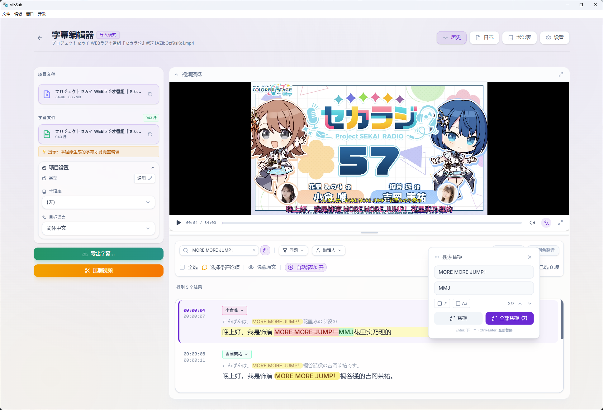

  
  <h1>MioSub (喵字幕)</h1>
  
<strong>Make Video Yours.</strong>

  
真正读懂上下文的 AI 字幕编辑器

  <!-- 🔥 大按钮 -->
  

    
    &nbsp;
    
  

  <!-- Badges -->
  

    
    
    
    
  

---

## ⚡ 30 秒看懂 MioSub

> 还在用剪映手搓字幕？还在忍受机翻把 "Fire in the hole" 翻成 "洞里着火了"？

**MioSub** 不是又一个翻译工具——它能**真正读懂**你的视频。粘贴链接，喝杯咖啡，回来收视频。

---

## 🎭 效果对比

| 普通机翻 ❌                              | MioSub 智能翻译 ✅ |
| :--------------------------------------- | :----------------- |
| "Fire in the hole!" → "洞里着火了"       | "小心手雷！"       |
| "It's a piece of cake." → "这是一块蛋糕" | "这简直小菜一碟"   |
| "Break a leg!" → "摔断一条腿"            | "祝你好运！"       |

---

## 🎯 这是为谁准备的？

| 如果你是...             | MioSub 能帮你...             |
| :---------------------- | :--------------------------- |
| 📺 **视频搬运 UP 主**   | 每天搬运 5 个视频省下 4 小时 |
| 🎬 **字幕组成员**       | 一键生成初稿，专注校对创译   |
| 📚 **外语学习者**       | 看懂生肉，双语字幕辅助学习   |
| 🎙️ **播客/Vlog 创作者** | 自动转写+翻译+压制，一条龙   |

---

## ✨ 核心亮点

|                     |                                              |
| :------------------ | :------------------------------------------- |
| 🧠 **上下文感知**   | 先读完全片再翻译，杜绝"断章取义"式误译       |
| 📚 **术语自动提取** | 人名地名自动识别，全片译名前后一致           |
| 🌊 **毫秒级对齐**   | 强迫症福音：时间轴精准到波形级别             |
| 🚀 **全自动流水线** | 粘贴链接 → 自动下载 → 转写 → 翻译 → 压制成片 |

---

## 📥 3 步上手

1. **下载** → [点击下载](https://github.com/corvo007/Gemini-Subtitle-Pro/releases)，解压即用
2. **配置** → 填入 Gemini API Key ([👉 免费获取教程](https://miosub.netlify.app/docs/guide/get-key))
3. **运行** → 粘贴视频链接，点击开始，去喝杯咖啡 ☕

---

## 🎬 效果展示

| 类型         | 链接                                                         | 说明                       |
| :----------- | :----------------------------------------------------------- | :------------------------- |
| 🎙️ 声优电台  | [BV1XBrsBZE92](https://www.bilibili.com/video/BV1XBrsBZE92/) | 日语 30 分钟，含说话人标注 |
| 🚃 铁道 vlog | [BV1k1mgBJEEY](https://www.bilibili.com/video/BV1k1mgBJEEY/) | 日语 29 分钟，大量专业术语 |

  

---

## 📖 更多内容

想了解本地 Whisper 配置、时间轴对齐、视频下载等进阶功能？

👉 **[查看完整文档](https://miosub.netlify.app/docs)**

---

## 🤝 贡献 & 支持

- 🐛 [反馈问题](https://github.com/corvo007/Gemini-Subtitle-Pro/issues)
- 💡 [提交 PR](https://github.com/corvo007/Gemini-Subtitle-Pro/pulls)
- ⭐ 觉得好用？给个 Star 支持一下！

---

## 🙏 致谢

[Google Gemini](https://deepmind.google/technologies/gemini/) · [OpenAI Whisper](https://openai.com/research/whisper) · [whisper.cpp](https://github.com/ggerganov/whisper.cpp) · [yt-dlp](https://github.com/yt-dlp/yt-dlp) · [FFmpeg](https://ffmpeg.org/) · [Electron](https://www.electronjs.org/)

---

🔍 SEO Keywords

`YouTube 视频自动加字幕` · `Bilibili 翻译工具` · `AI 字幕生成器` · `免费视频翻译软件` · `UP主字幕神器` · `Best AI Subtitle Generator` · `MioSub vs SmartSub` · `剪映替代品`

