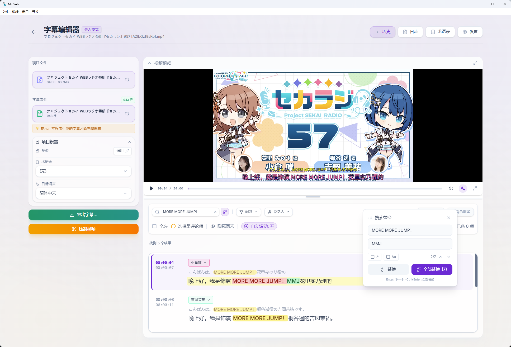

<div align="center">
  

  <h1>MioSub</h1>
  <p><em>formerly Gemini-Subtitle-Pro</em></p>

  <p><strong>世界的内容，你的语言。</strong></p>
  <p>真正读懂上下文的 AI 字幕编辑器</p>

  <p>
    <a href="https://miosub.app/docs">📖 文档</a> ·
    <a href="https://demo.miosub.app">🚀 在线体验</a> ·
    <a href="https://github.com/corvo007/Gemini-Subtitle-Pro/releases">📥 下载</a> ·
    <a href="https://github.com/corvo007/Gemini-Subtitle-Pro/issues">🐛 反馈问题</a> ·
    <a href="https://qm.qq.com/cgi-bin/qm/qr?k=qBoSXr8a668tJm80UbPcyvpey8mwfQ2H&jump_from=webapi&authKey=6fQajPs64A/yue/dKEMfZTxBQ8+SBuPugOTA6tC+3CuHW1NyNZFRwomo75sF1zUR">💬 QQ 群</a> ·
    <a href="./docs/README_en.md">🌐 English</a>
  </p>

  <p>
    <a href="https://github.com/corvo007/Gemini-Subtitle-Pro/stargazers"></a>
    <a href="https://github.com/corvo007/Gemini-Subtitle-Pro/releases"></a>
    <a href="https://github.com/corvo007/Gemini-Subtitle-Pro/releases"></a>
    <a href="https://github.com/corvo007/Gemini-Subtitle-Pro/actions"></a>
    <a href="https://github.com/corvo007/Gemini-Subtitle-Pro/blob/main/LICENSE"></a>
    <a href="https://deepwiki.com/corvo007/Gemini-Subtitle-Pro"></a>
  </p>

  <p>
    
    
    
    
  </p>
</div>

---

## 还在逐句校对机翻？

传统字幕工具让你在「转录」「翻译」「校对」「时间轴」之间反复横跳。

**MioSub 不一样。** 粘贴链接，喝杯咖啡，回来收成品。

---

## v3.0 亮点

| 特性                     | 说明                                                 |
| :----------------------- | :--------------------------------------------------- |
| **时间轴对齐，开箱即用** | 内置 CTC 对齐器，毫秒级精度，告别繁琐的外部工具配置  |
| **界面焕然一新**         | 编辑器、设置面板全面重构，更清爽、更流畅、功能更强大 |
| **不只是视频**           | 播客、电台、有声书——纯音频文件也能直接处理           |
| **中日文渲染更清晰**     | 内置 NotoSans 字体，告别缺字和方块                   |

> 从 v2.x 升级？查看 [迁移指南](https://miosub.app/docs/guide/migration)

---

## 核心特性

|      类别       | 亮点                                           |
| :-------------: | ---------------------------------------------- |
|   ⚡ **高效**   | **30 分钟视频 → 8 分钟出片**，边喝咖啡边等结果 |
|   🎯 **精准**   | 术语自动提取 · 毫秒级对齐 · 说话人自动标注     |
|  🌍 **多语言**  | 中/英/日 界面，支持 100+ 语言互译              |
|  🚀 **全自动**  | 粘贴链接 → 自动出成品，全程无需干预            |
|  🖥️ **编辑器**  | 边看边改，实时预览字幕效果                     |
| 📦 **导入导出** | SRT/ASS 导入，双语字幕导出，一键压制成片       |

---

## 界面预览

<div align="center">
  
  <p><em>实时字幕预览 · 自动滚动 · 说话人标注 · 悬浮播放 · 搜索与替换</em></p>
</div>

---

## 效果展示

**一次生成，无人工校对：**

| 类型         | 链接                                                         | 说明                                                           |
| :----------- | :----------------------------------------------------------- | :------------------------------------------------------------- |
| 🎙️ 声优电台  | [BV1XBrsBZE92](https://www.bilibili.com/video/BV1XBrsBZE92/) | 日语 30 分钟，含说话人标注                                     |
| 🚃 铁道 vlog | [BV1k1mgBJEEY](https://www.bilibili.com/video/BV1k1mgBJEEY/) | 日语 29 分钟，大量专业术语                                     |
| 🎬 电影解说  | [BV1MG6CBvEzd](https://www.bilibili.com/video/BV1MG6CBvEzd/) | 油库里 PJSK 剧场版彩蛋解说，语速极快、大量角色/组合/P主/歌曲名 |

---

## 快速开始

### 系统要求

| 平台    | 版本                        |
| :------ | :-------------------------- |
| Windows | 10/11 (64-bit)              |
| macOS   | 12+ (Intel / Apple Silicon) |
| Linux   | x64 / arm64 (AppImage)      |

另需 4GB+ 可用内存和网络连接。

### 三步上手

1. **下载** — 访问 [Releases](https://github.com/corvo007/Gemini-Subtitle-Pro/releases)，选择对应平台安装包
2. **配置** — 打开设置，填写 Gemini API Key（和Gemini Endpoint，注意只需要填写域名（如：https://yunwu.ai ）。如需使用本地 Whisper，请参考[完整文档](https://miosub.app/docs/guide/whisper)）
3. **开始** — 粘贴视频链接或导入本地文件

> **提示**：
>
> - API Key 需支持 **Gemini 2.5/3 Flash** 和 **Gemini 3 Pro** 模型
> - 推荐使用中转站（如 [云雾 API](https://yunwu.ai/register?aff=wmHr)）。这个中转站无需翻墙、无需信用卡、无最低充值限制，而且是我用过很多家中比较便宜，比较稳定，支持Gemini的功能比较多的一家。

---

## 进阶配置

本地 Whisper、时间轴对齐等进阶功能配置，请参阅 [📖 完整文档](https://miosub.app/docs/guide)。

---

## 🚀 本地开发

**前提条件**: Node.js 18+

```bash
# 安装依赖
yarn install

# 运行应用
yarn electron:dev

# 构建应用
yarn electron:build
```

打包完成后，可在 `release` 目录下找到安装包。

---

## 贡献 & 支持

遇到问题？有好点子？

- [反馈问题](https://github.com/corvo007/Gemini-Subtitle-Pro/issues) — 我们会认真对待每一个 issue
- [提交 PR](https://github.com/corvo007/Gemini-Subtitle-Pro/pulls) — 欢迎贡献代码
- 加入 [QQ 群（1082480420）](https://qm.qq.com/cgi-bin/qm/qr?k=qBoSXr8a668tJm80UbPcyvpey8mwfQ2H&jump_from=webapi&authKey=6fQajPs64A/yue/dKEMfZTxBQ8+SBuPugOTA6tC+3CuHW1NyNZFRwomo75sF1zUR) — 交流使用心得、获取最新动态、反馈问题、提出功能建议
- 觉得好用？给个 Star 让更多人发现这个项目

---

## 致谢

[Google Gemini](https://deepmind.google/technologies/gemini/) · [OpenAI Whisper](https://openai.com/research/whisper) · [whisper.cpp](https://github.com/ggerganov/whisper.cpp) · [yt-dlp](https://github.com/yt-dlp/yt-dlp) · [FFmpeg](https://ffmpeg.org/) · [Electron](https://www.electronjs.org/)

---

## Star History

[](https://star-history.com/#corvo007/Gemini-Subtitle-Pro&Date)

---

本项目基于 [AGPL-3.0 License](LICENSE) 开源

<sub>Made with ❤️ for subtitle creators worldwide</sub>

---

<details>
<summary>🔍 SEO 关键词</summary>

**核心关键词**：`AI字幕生成器` · `自动字幕` · `视频翻译软件` · `Gemini翻译` · `字幕编辑器` · `语音转文字` · `视频转录` · `双语字幕` · `自动生成字幕` · `智能字幕` · `Gemini-Subtitle-Pro` · `MioSub`

**平台关键词**：`YouTube字幕下载` · `YouTube自动字幕` · `B站字幕工具` · `哔哩哔哩字幕` · `抖音字幕` · `视频号字幕` · `短视频字幕`

**技术关键词**：`Whisper语音识别` · `强制对齐` · `字幕时间轴` · `毫秒级对齐` · `SRT编辑器` · `ASS字幕` · `字幕压制` · `硬字幕` · `软字幕` · `字幕烧录`

**场景关键词**：`字幕组工具` · `番剧翻译` · `动漫字幕` · `电影字幕` · `日语翻译` · `英语翻译` · `播客转录` · `会议记录` · `视频本地化` · `多语言字幕`

**竞品关键词**：`免费字幕生成` · `剪映替代` · `必剪替代` · `CapCut替代` · `最好的AI字幕工具` · `2026字幕软件推荐` · `无水印字幕生成`

---

**Primary Keywords**: `AI subtitle generator` · `automatic subtitles` · `video translation software` · `Gemini AI translation` · `subtitle editor` · `speech to text` · `video transcription` · `bilingual subtitles` · `Gemini-Subtitle-Pro` · `MioSub`

**Platform Keywords**: `YouTube auto captions` · `YouTube subtitle download` · `Bilibili subtitle tool` · `TikTok captions` · `social media subtitles`

**Technical Keywords**: `Whisper transcription` · `forced alignment` · `subtitle timing sync` · `millisecond alignment` · `SRT editor` · `ASS subtitle` · `hardcoded subtitles` · `burn in subtitles`

**Use Case Keywords**: `fansub tool` · `anime subtitle maker` · `movie subtitles` · `Japanese translation` · `podcast transcription` · `video localization` · `multilingual subtitles`

**Competitor Keywords**: `free subtitle generator` · `CapCut alternative` · `VEED alternative` · `Descript alternative` · `best AI subtitle tool 2026` · `no watermark subtitle generator`

</details>
