# Gemini Subtitle Pro - Project Architecture Document

[中文文档 (Chinese Documentation)](./ARCHITECTURE_zh.md)

## 📖 Project Overview

**Gemini Subtitle Pro** is an AI-powered subtitle creation, translation, and polishing tool. Built with React + Vite + Electron tech stack, supporting both Web and Desktop client deployment.

- **Tech Stack**: React 19, Vite 6, Electron 39, TypeScript
- **AI Engines**: Google Gemini (Translation/Polishing), OpenAI Whisper (Speech Recognition)

---

## 🏗️ Technology Stack Architecture

### Technology Stack Layered Diagram

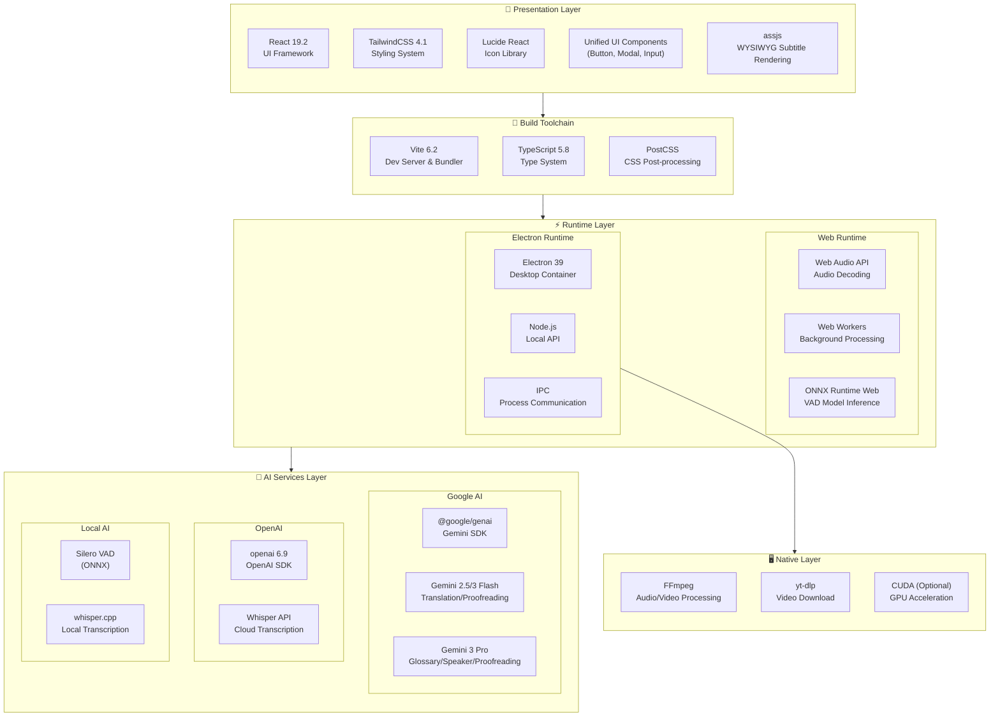

### Dependency Version Overview

| Category             | Dependency         | Version | Purpose                    |
| :------------------- | :----------------- | :------ | :------------------------- |
| **Core Frameworks**  | React              | 19.2    | UI Framework               |
|                      | Vite               | 6.2     | Build Tool                 |
|                      | TypeScript         | 5.8     | Type System                |
|                      | Electron           | 39      | Desktop Container          |
| **AI SDK**           | @google/genai      | Latest  | Gemini API                 |
|                      | openai             | Latest  | Whisper API                |
|                      | onnxruntime-web    | 1.23    | VAD Inference              |
| **Audio Processing** | @ricky0123/vad-web | 0.0.30  | Silero VAD Wrapper         |
|                      | fluent-ffmpeg      | 2.1     | FFmpeg Control             |
| **i18n**             | i18next            | 25.7    | Internationalization Core  |
|                      | react-i18next      | 16.5    | React Bindings             |
| **Rendering**        | assjs              | 0.1.4   | WYSIWYG Subtitle Rendering |
| **Styling**          | TailwindCSS        | 4.1     | Atomic CSS                 |
|                      | Lucide React       | 0.554   | Icon Library               |
| **Utils**            | clsx / tw-merge    | Latest  | Style Merging              |

---

## 📏 Code Standards & Engineering

### Path Aliases

This project uses path aliases comprehensively under `src` and `electron` directories. **Relative paths are prohibited** (like `../../`) for cross-level module references, except for same-level file references (using aliases uniformly is recommended).

- `@/*` -> `src/*` (Core Source Code)
- `@components/*` -> `src/components/*`
- `@hooks/*` -> `src/hooks/*`
- `@services/*` -> `src/services/*`
- `@utils/*` -> `src/utils/*`
- `@types/*` -> `src/types/*`
- `@lib/*` -> `src/lib/*` (New)
- `@electron/*` -> `electron/*` (Electron Main Process Code)

### Directory Organization Principles

- **Co-location Principle**: Utility functions or components used only within a specific module should be placed in that module's `utils` or `shared` subdirectory, rather than elevated to global.
  - For example, `src/components/endToEnd/wizard/utils/validation.ts` serves only the wizard module.
- **Separation of Concerns**:
  - `src/utils`: Global common, pure JavaScript/UI helper functions.
  - `src/services/utils`: Infrastructure, logging, system-level tools.

---

## 🧱 Application Module Architecture

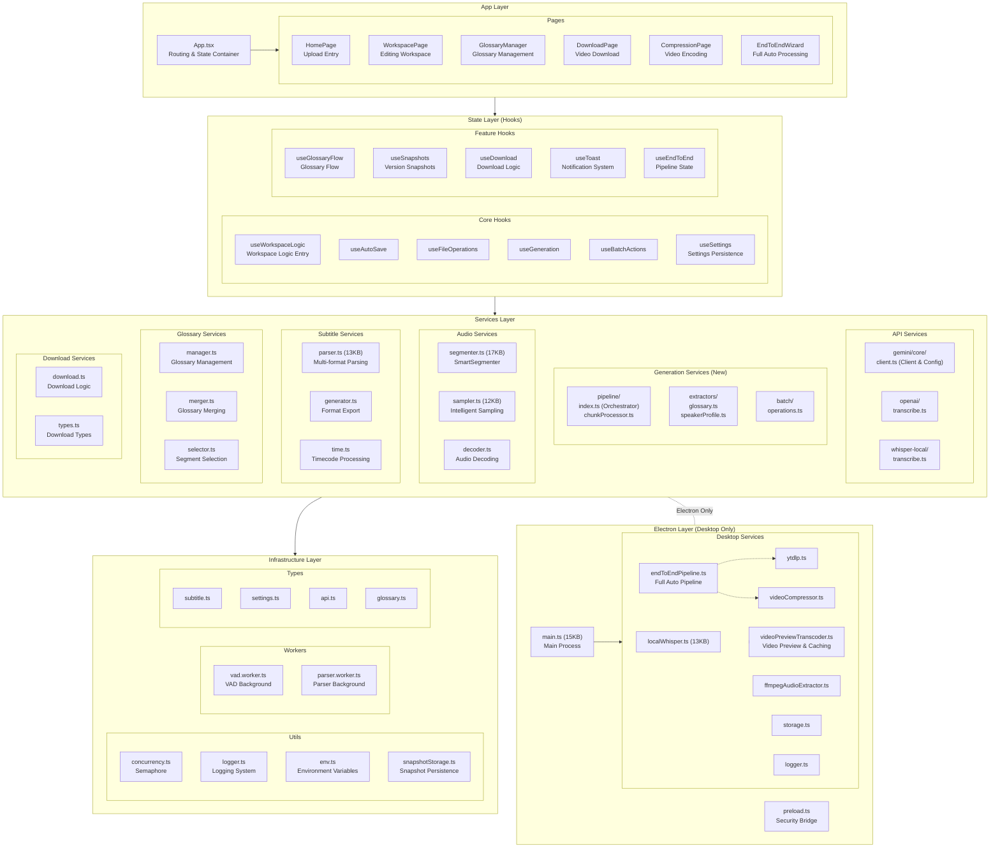

### Module Dependency Graph

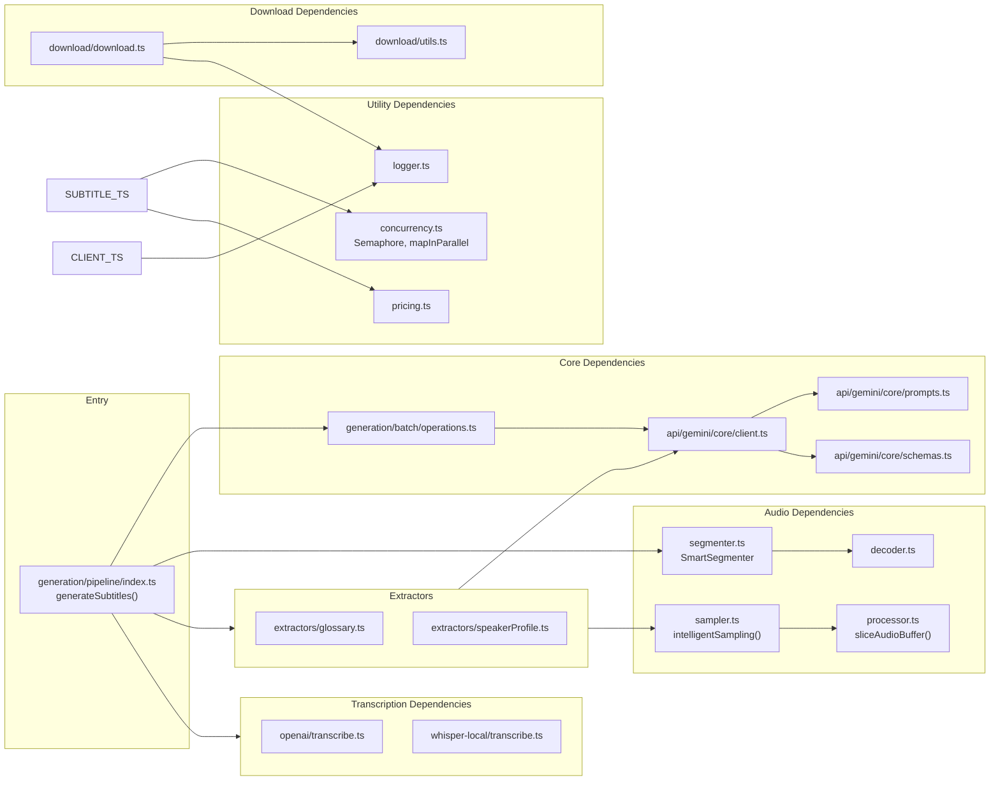

---

## 📁 Directory Structure

```
Gemini-Subtitle-Pro/
├── 📂 src/                          # Frontend Source Code
│   ├── 📄 App.tsx                   # Application Main Entry
│   ├── 📄 index.tsx                 # React Render Entry
│   ├── 📄 index.css                 # Global Styles
│   ├── 📄 i18n.ts                   # [NEW] i18n Configuration Entry
│   │
│   ├── 📂 components/               # UI Components
│   │   ├── 📂 common/               # Common Business Components (Header, PageHeader, etc.)
│   │   ├── 📂 editor/               # Subtitle Editor Components (SubtitleRow, Batch, etc.)
│   │   ├── 📂 pages/                # Page-level Components (HomePage, WorkspacePage, etc.)
│   │   ├── 📂 ui/                   # Base UI Component Library (Modal, Toggle, TextInput...)
│   │   ├── 📂 settings/             # Settings-related Components (SettingsModal, SettingsPanel, etc.)
│   │   ├── 📂 layout/               # Layout Containers
│   │   ├── 📂 modals/               # Business Modals (SettingsModal, etc.)
│   │   ├── 📂 endToEnd/             # End-to-End Wizard Components
│   │   └── 📂 ...                   # Other feature-divided component directories
│   │
│   ├── 📂 hooks/                    # React Hooks
│   │   ├── 📂 useWorkspaceLogic/    # Core Workspace Logic (Split into multiple modules)
│   │   │   ├── 📄 index.ts          # Entry
│   │   │   └── 📄 ...               # Sub-logic Hooks
│   │   ├── 📄 useHardwareAcceleration.ts # Hardware Acceleration State
│   │   ├── 📄 useSettings.ts        # Settings Management
│   │   ├── 📄 useDownload.ts        # Download Logic
│   │   └── ...                      # Other Feature Hooks
│   │
│   ├── 📂 locales/                  # [NEW] Internationalization Resources
│   │   ├── 📂 zh-CN/                # Chinese (Simplified)
│   │   │   ├── 📄 common.json       # Common Texts
│   │   │   ├── 📄 home.json         # Home Page
│   │   │   ├── 📄 editor.json       # Editor
│   │   │   ├── 📄 settings.json     # Settings
│   │   │   ├── 📄 endToEnd.json     # End-to-End Wizard
│   │   │   └── 📄 ...               # Other Namespaces
│   │   └── 📂 en-US/                # English
│   │       └── 📄 ...               # Same Structure
│   │
│   ├── 📂 services/                 # Service Layer (Pure Logic)
│   │   ├── 📂 api/                  # API Integration (Gemini Core, OpenAI)
│   │   │   └── 📂 gemini/           # Gemini Basic Client and Config
│   │   │       ├── 📂 core/         # Core API Logic
│   │   │       └── 📂 utils/        # API Utility Functions
│   │   ├── 📂 generation/           # Generation Services (Core Business Logic)
│   │   │   ├── 📂 pipeline/         # Complete Pipeline (Orchestrator, ChunkProcessor)
│   │   │   ├── 📂 extractors/       # Information Extraction (Glossary, Speaker)
│   │   │   ├── 📂 batch/            # Batch Operations
│   │   │   └── 📂 debug/            # Debug Tools
│   │   ├── 📂 audio/                # Audio Processing (Segmenter, Sampler)
│   │   ├── 📂 subtitle/             # Subtitle Parsing and Generation (Parser, Generator)
│   │   ├── 📂 download/             # Download Service Logic
│   │   └── 📂 utils/                # Common Service Tools (Logger, URL Validation)
│   │
│   ├── 📂 config/                   # Configuration Module
│   │   ├── 📄 index.ts              # Config Export Entry
│   │   └── 📄 models.ts             # Model Config (Step→Model Mapping)
│   │
│   ├── 📂 lib/                      # Common Libraries
│   │   ├── 📄 cn.ts                 # Tailwind Classname Merge Tool
│   │   └── 📄 text.ts               # Text Processing Tool
│   │
│   ├── 📂 types/                    # TypeScript Type Definitions
│   └── 📂 workers/                  # Web Workers
│
├── 📂 electron/                     # Electron Desktop Code
│   ├── 📄 main.ts                   # Main Process Entry
│   ├── 📄 preload.ts                # Preload Script
│   └── 📂 services/                 # Desktop Services (Node.js Env)
│       ├── 📄 localWhisper.ts       # Local Whisper Call
│       ├── 📄 videoPreviewTranscoder.ts # [NEW] Video Preview & Caching
│       ├── 📄 logger.ts             # Unified Logging Service
│       └── ...                      # Other System-level Services
│
└── 📄 package.json                  # Project Config
```

---

## 🔄 Core Process Diagrams

### 1. Complete Pipeline Concurrent Architecture

The diagram below shows the complete concurrent architecture for subtitle generation, including parallel async tasks, Semaphore control, and cross-task dependencies:

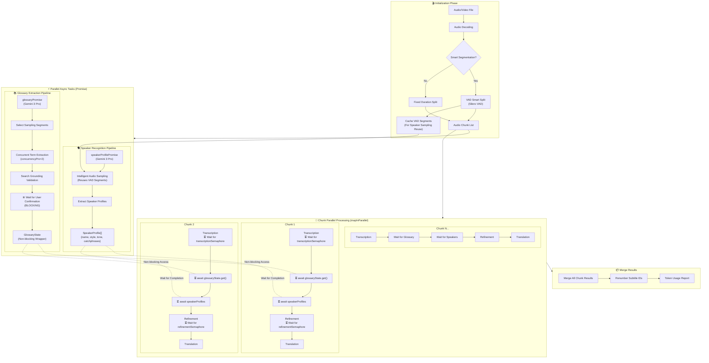

---

### 2. Dual Semaphore Concurrency Control Details

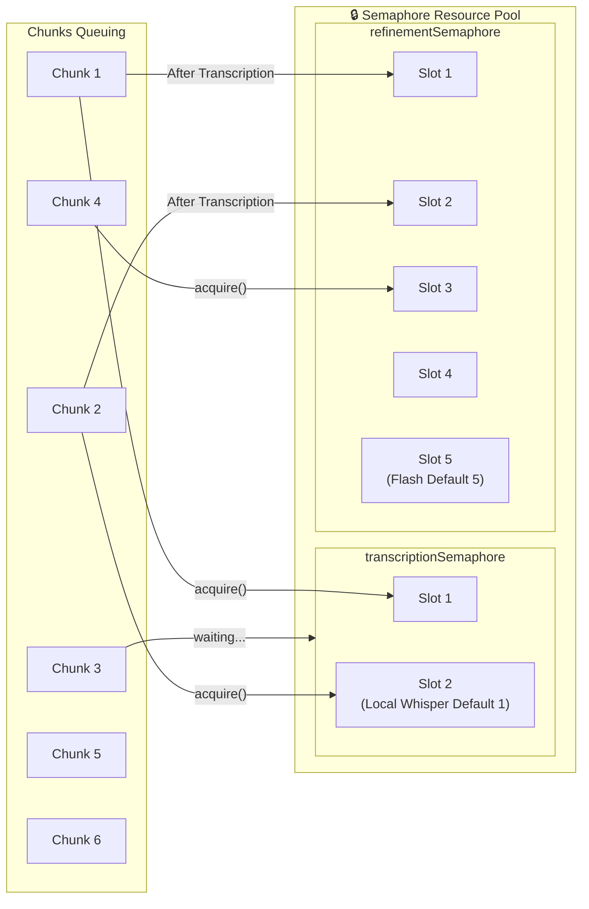

**Configuration Explanation:**

| Semaphore                      | Purpose                    | Default Concurrency | Config Item          |
| :----------------------------- | :------------------------- | :------------------ | :------------------- |
| `transcriptionSemaphore`       | Controls Whisper API Calls | Local: 1, Cloud: 5  | `whisperConcurrency` |
| `refinementSemaphore`          | Controls Gemini Flash API  | 5                   | `concurrencyFlash`   |
| (Glossary Extraction Internal) | Controls Gemini Pro API    | 2                   | `concurrencyPro`     |

---

### 3. Chunk Internal 4-Stage Pipeline

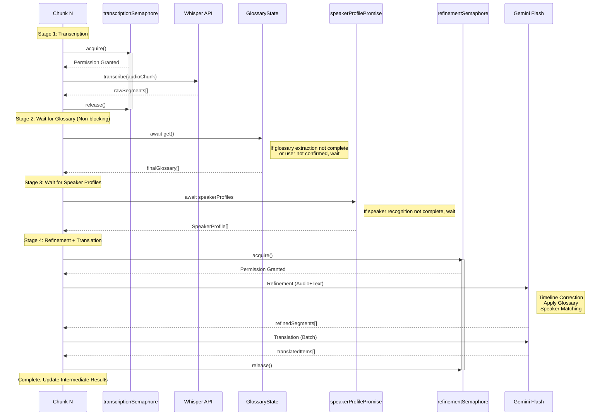

---

### 4. Glossary Extraction and User Interaction Flow

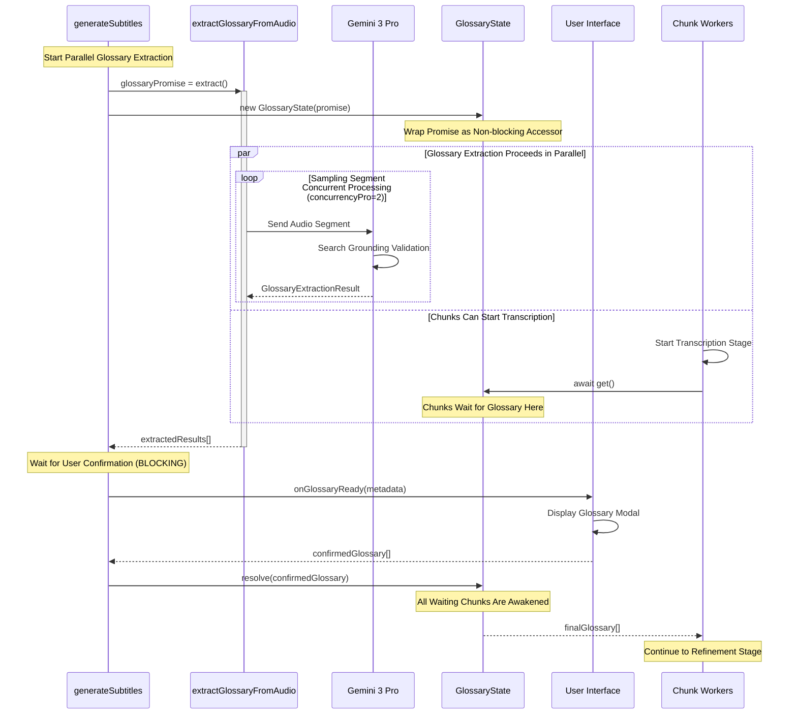

---

### 5. Speaker Recognition Position in Pipeline

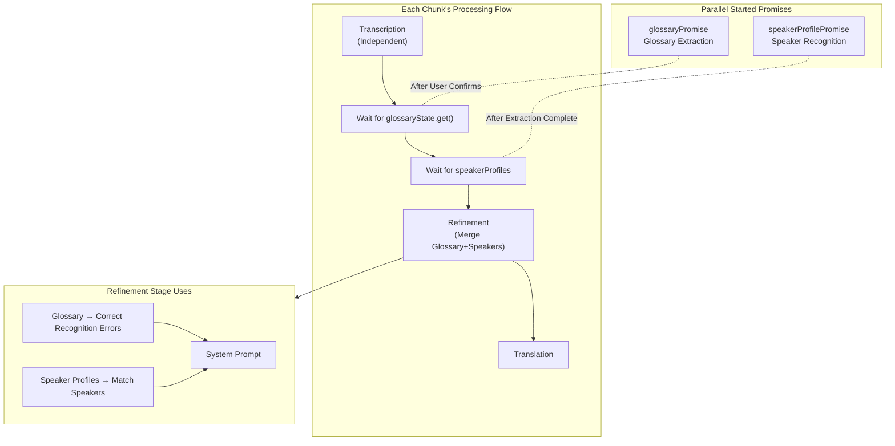

**Pipeline Dependency Summary:**

| Stage         | Dependencies                                | Description                                     |
| :------------ | :------------------------------------------ | :---------------------------------------------- |
| Transcription | `transcriptionSemaphore`                    | Independent Execution, No Blocking Dependencies |
| Wait Glossary | `glossaryState.get()`                       | Must Wait for Glossary Confirmation Complete    |
| Wait Speakers | `speakerProfilePromise`                     | Must Wait for Speaker Recognition Complete      |
| Refinement    | `refinementSemaphore` + Glossary + Speakers | Merge and Use All Data                          |
| Translation   | (Within Refinement Semaphore)               | Completed Together with Refinement              |

---

### 6. Desktop Full Workflow (Download-Create-Encode)

Desktop-exclusive complete workflow, connecting from material acquisition to final output:

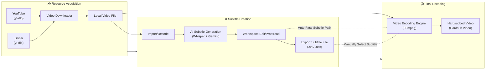

---

### 7. Full Auto End-to-End Mode (End-to-End Pipeline)

This is an Electron-exclusive core feature that coordinates Main Process (resource scheduling) and Renderer Process (AI computation) through IPC communication, achieving "one-click cooked content".

#### 7.1 Cross-Process Interaction Architecture

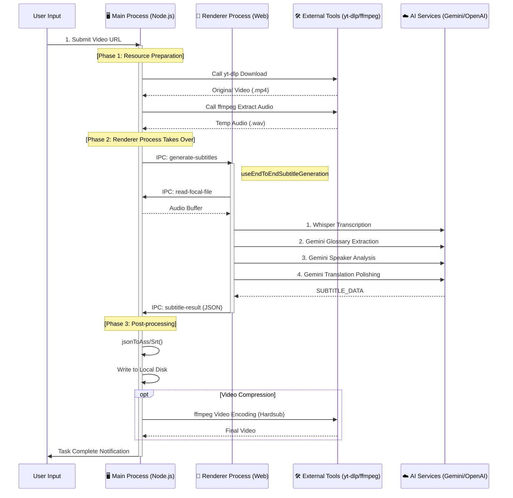

#### 7.2 Data Flow and State Management

All intermediate state and configuration is managed through the `EndToEndWizard` component, with data flow as follows:

1. **User Configuration**
   - Source: `EndToEndWizard` UI
   - Flow: Via `IPC (start-processing)` -> Main Process `EndToEndPipeline` Service
   - Content: URL, Model Selection, Translation Style, Encoding Parameters

2. **Media Stream**
   - `yt-dlp` -> Disk Temp Directory -> `ffmpeg` (Extract Audio) -> Disk WAV
   - Disk WAV -> `IPC (read-file)` -> Renderer Process Memory (ArrayBuffer) -> Web Audio API

3. **Subtitle Data**
   - Renderer Process generates `SubtitleItem[]` array
   - Passed back to Main Process via `IPC (subtitle-result)`
   - Main Process serializes object to ASS/SRT format text and writes to file

4. **Progress Feedback**
   - Each stage (Download/Transcribe/Encode) produces progress events
   - Main Process -> `IPC (progress)` -> Renderer Process `useEndToEnd` Hook -> UI Progress Bar

#### 7.3 Key IPC Channels

| Channel Name                    | Direction        | Payload           | Purpose                                                  |
| :------------------------------ | :--------------- | :---------------- | :------------------------------------------------------- |
| `end-to-end:start`              | Renderer -> Main | `EndToEndConfig`  | Start Full Auto Task                                     |
| `end-to-end:generate-subtitles` | Main -> Renderer | `path, config`    | Main Process Ready, Request Frontend to Start Generation |
| `end-to-end:subtitle-result`    | Renderer -> Main | `SubtitleItem[]`  | Frontend Complete, Return Results                        |
| `end-to-end:progress`           | Main -> Renderer | `stage, progress` | Real-time Progress Sync                                  |

---

## 🛰️ Custom Protocol for Media Playback

To bypass browser security restrictions (CSP, Sandbox) and support large file streaming, the desktop version implements a custom protocol:

### `local-video://` Protocol

- **Implementation**: `electron/main.ts`
- **Privileges**: `standard`, `secure`, `stream`, `supportFetchAPI`, `bypassCSP`.
- **Key Feature: Tailing Reader**: Support for reading "growing files" (transcoding in progress). It uses a polling mechanism to read new data as it is written to disk by FFmpeg.

---

## 📺 Video Preview & Caching Strategy

The system uses a fragmented MP4 (fMP4) transcoding strategy to balance compatibility and performance.

### Process Flow

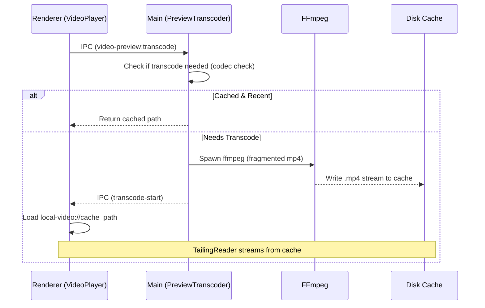

### Cache Lifecycle

- **Storage**: User data directory (`/preview_cache/`).
- **Limit**: Automatically enforces a total size limit (e.g., 2GB).
- **Cleanup**: Enforced on app startup and via manual UI action.
  | `video-preview:transcode` | Renderer -> Main | `{ filePath }` | Request video transcoding for preview |
  | `video-preview:transcode-start` | Main -> Renderer | `{ outputPath }` | Transcoding started |
  | `video-preview:transcode-progress` | Main -> Renderer | `{ percent }` | Transcoding progress update |
  | `video-preview:needs-transcode` | Renderer -> Main | `filePath` | Check if video needs transcoding |
  | `cache:get-size` | Renderer -> Main | - | Get preview cache size |
  | `cache:clear` | Renderer -> Main | - | Clear preview cache |

---

## 🧩 Core Module Descriptions

### 1. Generation Services Module (`src/services/generation/`) [NEW]

This is the refactored core business logic module, splitting the original Gemini API logic by responsibility:

| Submodule    | File/Directory          | Function Description                                                                      |
| :----------- | :---------------------- | :---------------------------------------------------------------------------------------- |
| `pipeline`   | `index.ts`              | Generation Flow Orchestrator, Coordinates Transcription, Extraction, Generation Full Flow |
|              | `chunkProcessor.ts`     | Single Chunk Processing Logic (Transcribe -> Wait Glossary/Speaker -> Translate)          |
|              | `translation.ts`        | Specific Translation Execution Logic                                                      |
|              | `glossaryHandler.ts`    | Glossary Application Logic                                                                |
|              | `resultTransformers.ts` | Result Transformation and Post-processing Logic                                           |
| `extractors` | `glossary.ts`           | Glossary Extractor (Gemini Pro + Search)                                                  |
|              | `speakerProfile.ts`     | Speaker Profile Extractor                                                                 |
| `batch`      | `operations.ts`         | Batch Proofreading and Timeline Fix Operations                                            |

### 2. Gemini API Core (`src/services/api/gemini/core/`)

Retains only the most basic API interaction capabilities:

| File         | Function Description                                            |
| :----------- | :-------------------------------------------------------------- |
| `client.ts`  | Gemini API Client Encapsulation, Handles auth, retry, and quota |
| `prompts.ts` | Basic Prompt Template Library                                   |
| `schemas.ts` | Structured Output Schema Definitions                            |

### 3. Audio Processing Module (`src/services/audio/`)

| File                 | Function Description                                                                                     |
| :------------------- | :------------------------------------------------------------------------------------------------------- |
| `segmenter.ts`       | **Smart Audio Segmenter**, Uses Silero VAD Model to Detect Voice Activity, Splits by Semantic Boundaries |
| `sampler.ts`         | Audio Sampling, Generates Audio Samples for AI Analysis                                                  |
| `decoder.ts`         | Audio Decoding, Supports Multiple Formats                                                                |
| `processor.ts`       | Audio Preprocessing, Normalization, etc.                                                                 |
| `converter.ts`       | Audio Format Conversion                                                                                  |
| `ffmpegExtractor.ts` | FFmpeg Audio Extraction (Core Logic)                                                                     |

### 4. Subtitle Processing Module (`src/services/subtitle/`)

| File                   | Function Description                                    |
| :--------------------- | :------------------------------------------------------ |
| `parser.ts`            | Subtitle Parser, Supports SRT/ASS/VTT and other formats |
| `generator.ts`         | Subtitle Export, Generates Bilingual Subtitle Files     |
| `time.ts`              | Timecode Processing Tool                                |
| `postCheck.ts`         | Subtitle Quality Post-check                             |
| `timelineValidator.ts` | Subtitle Timeline Logic Validation                      |

### 5. Download Service Module (`src/services/download/`)

| File          | Function Description               |
| :------------ | :--------------------------------- |
| `download.ts` | Video Download Logic Encapsulation |
| `utils.ts`    | Download-related Utility Functions |

### 6. Electron Desktop (`electron/`)

| File                               | Function Description                                                      |
| :--------------------------------- | :------------------------------------------------------------------------ |
| `main.ts`                          | Electron Main Process, Window Management, IPC Communication               |
| `preload.ts`                       | Preload Script, Exposes Secure Node.js API                                |
| `logger.ts`                        | **Unified Logging System**, Supports File Rotation and Multi-level Logs   |
| `services/localWhisper.ts`         | Local Whisper Model Call (whisper.cpp)                                    |
| `services/ffmpegAudioExtractor.ts` | FFmpeg Audio Extraction, Supports Video Files                             |
| `services/ytdlp.ts`                | Video Download Service (YouTube/Bilibili)                                 |
| `services/videoCompressor.ts`      | Video Encoding Service (Supports GPU Acceleration)                        |
| `services/endToEndPipeline.ts`     | **Full Auto Pipeline**, Orchestrates Download-Transcribe-Encode Full Flow |

### 7. Internationalization Module (`src/locales/`, `src/i18n.ts`) [NEW]

Full i18n support powered by i18next, enabling bilingual UI (Chinese/English):

| File/Directory | Function Description                                              |
| :------------- | :---------------------------------------------------------------- |
| `i18n.ts`      | i18n Configuration Entry, Initializes i18next with React bindings |
| `locales/`     | Translation Resources Root Directory                              |
| `zh-CN/`       | Chinese (Simplified) translations, 14 namespace files             |
| `en-US/`       | English translations, mirrors zh-CN structure                     |

**Namespace Organization:**

| Namespace     | Content                                |
| :------------ | :------------------------------------- |
| `common`      | Shared texts (buttons, labels, errors) |
| `home`        | Home page content                      |
| `workspace`   | Workspace page                         |
| `editor`      | Subtitle editor                        |
| `settings`    | Settings modal                         |
| `endToEnd`    | End-to-end wizard                      |
| `modals`      | Business modals                        |
| `services`    | API service messages                   |
| `compression` | Video compression page                 |
| `download`    | Download page                          |
| `progress`    | Progress indicators                    |
| `ui`          | UI components                          |
| `app`         | App-level texts                        |

---

## 🔧 Technical Highlights

### Concurrency Control

```typescript
// Use Semaphore to control concurrency count
const semaphore = new Semaphore(concurrency);
await mapInParallel(chunks, async (chunk) => {
  await semaphore.acquire();
  try {
    return await processChunk(chunk);
  } finally {
    semaphore.release();
  }
});
```

### Model Selection Strategy

Model configuration is centralized in `src/config/models.ts`, supporting different model selection per processing step:

| Processing Step      | Default Model          | Features                                       |
| :------------------- | :--------------------- | :--------------------------------------------- |
| `refinement`         | Gemini 2.5 Flash       | Timeline Correction (Avoids 3.0 Timestamp Bug) |
| `translation`        | Gemini 3 Flash Preview | Translation, Search Grounding                  |
| `glossaryExtraction` | Gemini 3 Pro Preview   | Multimodal, Term Extraction                    |
| `speakerProfile`     | Gemini 3 Pro Preview   | Speaker Analysis                               |
| `batchProofread`     | Gemini 3 Pro Preview   | High Quality Proofreading, Search Grounding    |
| `batchFixTimestamps` | Gemini 2.5 Flash       | Timeline Fix                                   |

Each step can be independently configured:

- `thinkingLevel`: Thinking Depth (`none`/`low`/`medium`/`high`)
- `useSearch`: Whether to Enable Google Search
- `maxOutputTokens`: Maximum Output Tokens

### Retry Mechanism

```typescript
// Automatically retry recoverable errors
async function generateContentWithRetry(
  ai: GoogleGenAI,
  params: any,
  retries = 3,
  signal?: AbortSignal,
  onUsage?: (usage: TokenUsage) => void,
  timeoutMs?: number
);
```

---

## 📊 Data Flow Architecture

### Main Data Flow Diagram

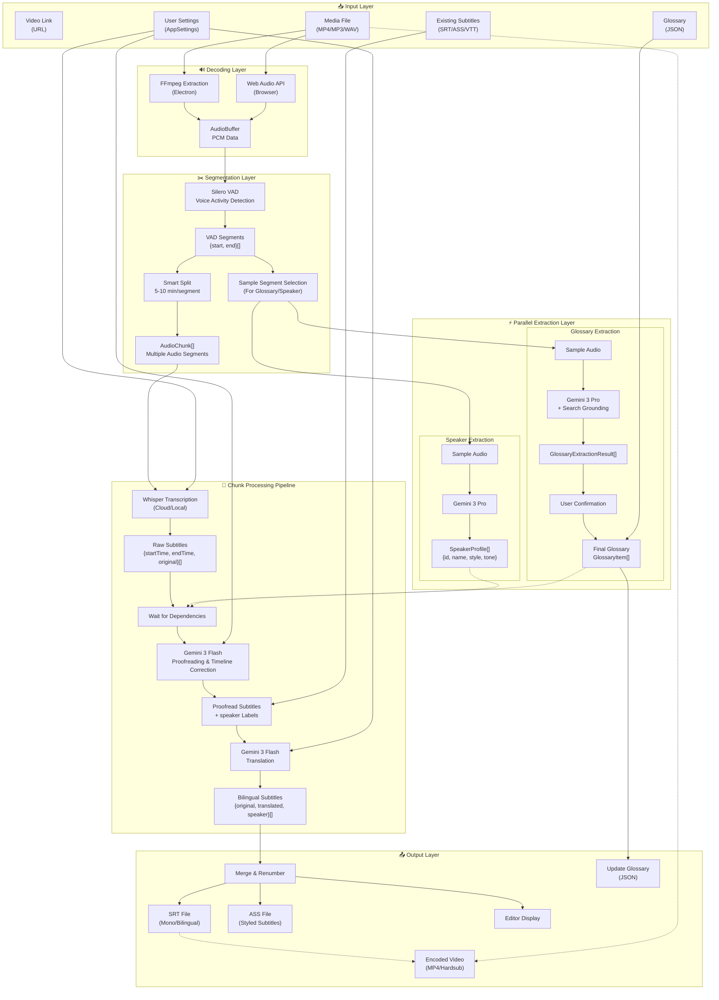

### Data Type Conversion Chain

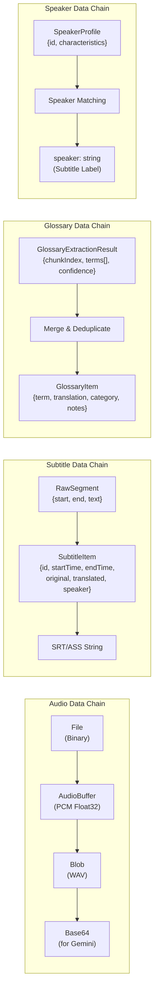

### State Data Flow

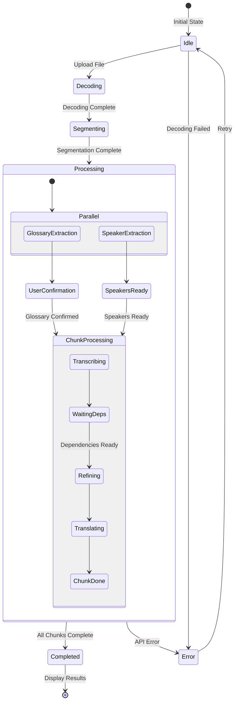

---

## 🚀 Deployment Architecture

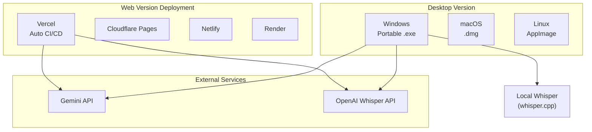

---

## 📝 Development Guide

### Environment Requirements

- Node.js 18+
- npm or yarn

### Quick Start

```bash
# Install Dependencies
yarn install

# Web Development Mode
yarn dev

# Electron Development Mode
yarn electron:dev

# Build Electron Application
yarn electron:build
```

### Environment Variables

```env
GEMINI_API_KEY=your_gemini_key    # Required: Translation and Proofreading
OPENAI_API_KEY=your_openai_key    # Optional: Cloud Whisper
```

---

## 📚 References

- [Google Gemini API Documentation](https://ai.google.dev/docs)
- [OpenAI Whisper API](https://platform.openai.com/docs/guides/speech-to-text)
- [whisper.cpp Project](https://github.com/ggerganov/whisper.cpp)
- [Silero VAD](https://github.com/snakers4/silero-vad)
