# Gemini Subtitle Pro - Project Architecture Document

[中文文档 (Chinese Documentation)](./ARCHITECTURE_zh.md)

## 📖 Project Overview

**Gemini Subtitle Pro** is an AI-powered subtitle creation, translation, and polishing tool. Built with React + Vite + Electron tech stack, supporting both Web and Desktop client deployment.

- **Tech Stack**: React 19, Vite 6, Electron 39, TypeScript
- **AI Engines**: Google Gemini (Translation/Polishing), OpenAI Whisper (Speech Recognition)

---

## 🏗️ Technology Stack Architecture

### Technology Stack Layered Diagram


### Dependency Version Overview

| Category             | Dependency         | Version | Purpose                    |
| :------------------- | :----------------- | :------ | :------------------------- |
| **Core Frameworks**  | React              | 19.2    | UI Framework               |
|                      | Vite               | 6.2     | Build Tool                 |
|                      | TypeScript         | 5.8     | Type System                |
|                      | Electron           | 39      | Desktop Container          |
| **AI SDK**           | @google/genai      | Latest  | Gemini API                 |
|                      | openai             | Latest  | Whisper API                |
|                      | onnxruntime-web    | 1.23    | VAD Inference              |
| **Audio Processing** | @ricky0123/vad-web | 0.0.30  | Silero VAD Wrapper         |
|                      | fluent-ffmpeg      | 2.1     | FFmpeg Control             |
| **i18n**             | i18next            | 25.7    | Internationalization Core  |
|                      | react-i18next      | 16.5    | React Bindings             |
| **Rendering**        | assjs              | 0.1.4   | WYSIWYG Subtitle Rendering |
| **Styling**          | TailwindCSS        | 4.1     | Atomic CSS                 |
|                      | Lucide React       | 0.554   | Icon Library               |
| **Utils**            | clsx / tw-merge    | Latest  | Style Merging              |

---

## 📏 Code Standards & Engineering

### Path Aliases

This project uses path aliases comprehensively under `src` and `electron` directories. **Relative paths are prohibited** (like `../../`) for cross-level module references, except for same-level file references (using aliases uniformly is recommended).

- `@/*` -> `src/*` (Core Source Code)
- `@components/*` -> `src/components/*`
- `@hooks/*` -> `src/hooks/*`
- `@services/*` -> `src/services/*`
- `@utils/*` -> `src/utils/*`
- `@types/*` -> `src/types/*`
- `@lib/*` -> `src/lib/*` (New)
- `@electron/*` -> `electron/*` (Electron Main Process Code)

### Directory Organization Principles

- **Co-location Principle**: Utility functions or components used only within a specific module should be placed in that module's `utils` or `shared` subdirectory, rather than elevated to global.
  - For example, `src/components/endToEnd/wizard/utils/validation.ts` serves only the wizard module.
- **Separation of Concerns**:
  - `src/utils`: Global common, pure JavaScript/UI helper functions.
  - `src/services/utils`: Infrastructure, logging, system-level tools.

---

## 🧱 Application Module Architecture


### Module Dependency Graph


---

## 📁 Directory Structure

```
Gemini-Subtitle-Pro/
├── 📂 src/                          # Frontend Source Code
│   ├── 📄 App.tsx                   # Application Main Entry
│   ├── 📄 index.tsx                 # React Render Entry
│   ├── 📄 index.css                 # Global Styles
│   ├── 📄 i18n.ts                   # [NEW] i18n Configuration Entry
│   │
│   ├── 📂 components/               # UI Components
│   │   ├── 📂 common/               # Common Business Components (Header, PageHeader, etc.)
│   │   ├── 📂 editor/               # Subtitle Editor & Video Preview Components
│   │   │   ├── 📄 VideoPlayerPreview.tsx  # [NEW] Progressive Video Player with ASS Rendering
│   │   │   ├── 📄 RegenerateModal.tsx     # [NEW] Batch Regenerate Modal
│   │   │   └── 📄 ...               # SubtitleRow, Batch, etc.
│   │   ├── 📂 compression/          # [NEW] Video Compression Page Components
│   │   │   ├── 📄 EncoderSelector.tsx # Encoder Selection & Config
│   │   │   └── 📄 ...
│   │   ├── 📂 pages/                # Page-level Components (HomePage, WorkspacePage, etc.)
│   │   ├── 📂 ui/                   # Base UI Component Library (Modal, Toggle, TextInput...)
│   │   ├── 📂 settings/             # Settings-related Components
│   │   │   ├── 📂 tabs/             # [NEW] Modular Settings Panels (GeneralTab, AboutTab, etc.)
│   │   │   └── 📄 SettingsModal.tsx # Settings Modal Container
│   │   ├── 📂 layout/               # Layout Containers
│   │   ├── 📂 modals/               # Business Modals (GlossaryConfirmationModal, SpeakerManagerModal, etc.)
│   │   ├── 📂 endToEnd/             # End-to-End Wizard Components
│   │   └── 📂 ...                   # Other feature-divided component directories
│   │
│   ├── 📂 hooks/                    # React Hooks
│   │   ├── 📂 useWorkspaceLogic/    # Core Workspace Logic
│   │   ├── 📄 useVideoPreview.ts    # [NEW] Video Preview & Transcoding State
│   │   └── ...                      # Other Feature Hooks
│   │
│   ├── 📂 locales/                  # [NEW] Internationalization Resources
│   │   ├── 📂 zh-CN/                # Chinese (Simplified)
│   │   ├── 📂 en-US/                # English
│   │   └── 📂 ja-JP/                # Japanese (New in v2.13)
│   │
│   ├── 📂 services/                 # Service Layer (Pure Logic)
│   │   ├── 📂 api/                  # API Integration
│   │   ├── 📂 generation/           # Generation Services (Core Business Logic)
│   │   │   ├── 📂 pipeline/         # Complete Pipeline
│   │   │   │   ├── 📂 core/         # [NEW] Base step class and type definitions
│   │   │   │   └── 📂 steps/        # [NEW] Step implementations (Transcription, Refinement, Alignment, Translation, Proofread)
│   │   │   ├── 📂 extractors/       # Information Extraction
│   │   │   └── 📂 batch/            # Batch Operations (proofread.ts, regenerate.ts)
│   │   ├── 📂 audio/                # Audio Processing
│   │   ├── 📂 subtitle/             # Subtitle Parsing and Generation
│   │   │   ├── 📄 reconciler.ts     # [NEW] Data Reconciler (Data Hub)
│   │   │   └── 📄 ...
│   │   ├── 📂 alignment/            # [NEW] Alignment Services
│   │   │   ├── 📂 strategies/       # Alignment Strategies (CTC)
│   │   │   └── 📄 index.ts          # Strategy Factory
│   │   ├── 📂 download/             # Download Service Logic
│   │   └── 📂 utils/                # Common Service Tools
│   │
│   ├── 📂 config/                   # Configuration Module
│   │   ├── 📄 index.ts              # Config Export Entry
│   │   └── 📄 models.ts             # Model Config
│   │
│   ├── 📂 lib/                      # Common Libraries
│   │
│   ├── 📂 types/                    # [NEW] Centralized Type Definitions
│   │   ├── 📄 pipeline.ts           # Pipeline Shared Types
│   │   ├── 📄 alignment.ts          # Alignment Types
│   │   └── 📄 ...
│   │
│   └── 📂 workers/                  # Web Workers
│
├── 📂 electron/                     # Electron Desktop Code
│   ├── 📄 main.ts                   # Main Process Entry
│   ├── 📄 preload.ts                # Preload Script
│   ├── 📄 logger.ts                 # Unified Logging Service (with JSON View)
│   ├── 📂 utils/                    # [NEW] Utility Modules
│   │   └── 📄 paths.ts              # Portable path resolution
│   └── 📂 services/                 # Desktop Services (Node.js Env)
│       ├── 📄 localWhisper.ts       # Local Whisper Call (with GPU Detection)
│       ├── 📄 videoPreviewTranscoder.ts # Video Preview & Caching
│       ├── 📄 storage.ts            # Portable storage service
│       └── ...                      # Other System-level Services
│
└── 📄 package.json                  # Project Config
```

---

## 🔄 Core Process Diagrams

### 1. Complete Pipeline Concurrent Architecture

The diagram below shows the complete concurrent architecture for subtitle generation, including parallel async tasks, Semaphore control, and cross-task dependencies:


---

### 2. Dual Semaphore Concurrency Control Details

```mermaid
flowchart LR
    subgraph SEMAPHORES["🔒 Semaphore Resource Pool"]
        subgraph TRANS["transcriptionSemaphore"]
            T1["Slot 1"]
            T2["Slot 2<br/>(Local Whisper Default 1)"]
        end

        subgraph ALIGN["alignmentSemaphore"]
            A1["Slot 1"]
            A2["Slot 2"]
            A3["Slot 3"]
        end

        subgraph REFINE["refinementSemaphore"]
            R1["Slot 1"]
            R2["Slot 2"]
            R3["Slot 3"]
            R4["Slot 4"]
            R5["Slot 5<br/>(Flash Default 5)"]
        end
    end

    subgraph CHUNKS["Chunks Queuing"]
        C1["Chunk 1"]
        C2["Chunk 2"]
        C3["Chunk 3"]
        C4["Chunk 4"]
        C5["Chunk 5"]
        C6["Chunk 6"]
    end

    C1 -->|"acquire()"| T1
    C2 -->|"acquire()"| T2
    C3 -->|"waiting..."| TRANS

    C1 -->|"After Transcription"| R1
    C2 -->|"After Transcription"| R2

    C1 -->|"After Refinement"| A1
    C2 -->|"After Refinement"| A2
```



**Configuration Explanation:**

| Semaphore                      | Purpose                    | Default Concurrency | Config Item            |
| :----------------------------- | :------------------------- | :------------------ | :--------------------- |
| `transcriptionSemaphore`       | Controls Whisper API Calls | Local: 1, Cloud: 5  | `whisperConcurrency`   |
| `refinementSemaphore`          | Controls Gemini Flash API  | 5                   | `concurrencyFlash`     |
| `alignmentSemaphore`           | Controls Alignment Tools   | 2                   | `concurrencyAlignment` |
| (Glossary Extraction Internal) | Controls Gemini Pro API    | 2                   | `concurrencyPro`       |

---

### 3. Chunk Internal 5-Stage Pipeline


---

### 3.5 Pipeline Step Architecture (New in v2.13)

v2.13 introduces a class-based step architecture, modularizing Chunk processing logic:


**Step Descriptions:**

| Step                | File                   | Input            | Output              | Purpose                                  |
| :------------------ | :--------------------- | :--------------- | :------------------ | :--------------------------------------- |
| `TranscriptionStep` | `TranscriptionStep.ts` | AudioChunk       | `SubtitleItem[]`    | Whisper speech-to-text                   |
| `WaitForDepsStep`   | `WaitForDepsStep.ts`   | -                | Glossary + Speakers | Wait for glossary and speaker extraction |
| `RefinementStep`    | `RefinementStep.ts`    | `SubtitleItem[]` | `SubtitleItem[]`    | Timeline correction, apply glossary      |
| `AlignmentStep`     | `AlignmentStep.ts`     | `SubtitleItem[]` | `SubtitleItem[]`    | CTC forced alignment                     |
| `TranslationStep`   | `TranslationStep.ts`   | `SubtitleItem[]` | `SubtitleItem[]`    | AI translation                           |
| `ProofreadStep`     | `ProofreadStep.ts`     | `SubtitleItem[]` | `SubtitleItem[]`    | Batch proofreading (optional)            |

---

### 3.6 Batch Operations Comparison (New in v2.13)

v2.13 splits batch operations into two independent modes:

| Feature        | Proofread                                  | Regenerate                                                         |
| :------------- | :----------------------------------------- | :----------------------------------------------------------------- |
| **File**       | `batch/proofread.ts`                       | `batch/regenerate.ts`                                              |
| **Purpose**    | Polish and proofread existing translations | Completely reprocess selected segments                             |
| **Pipeline**   | Gemini Pro proofreading only               | Transcribe → Refine → Align → Translate (full pipeline)            |
| **Input**      | Existing `SubtitleItem[]`                  | Raw audio + time range                                             |
| **Preserved**  | Original timeline preserved                | Everything regenerated                                             |
| **Use Cases**  | Improve translation quality, fix typos     | Fix transcription errors, re-segment, re-run after glossary update |
| **User Hints** | Not supported                              | Supports transcription and translation hints                       |
| **Model**      | Gemini 3 Pro                               | Whisper + Gemini Flash                                             |


---

### 4. Data Integrity & Reconciliation (The "Data Hub")

The system employs a rigorous **Data Reconciliation Strategy** (`src/services/subtitle/reconciler.ts`) to ensure metadata persistence across the pipeline matches (Refinement, Alignment, Translation), even when the number of segments changes due to splitting or merging.

#### 4.1 The Reconciler Logic

The `reconcile(prev, curr)` function acts as the "Data Hub" connecting pipeline stages. It intelligently merges `prev` (source) metadata into `curr` (newly generated) segments:

- **Semantic Metadata** (Always Inherited):
  - `speaker` (Speaker ID/Name)
  - `comment` (User comments)
  - **Logic**: Inherited from the `prev` segment with the highest overlap ratio. Even if segments are split, they all inherit the parent's speaker.
- **Internal State** (Conditionally Inherited):
  - `alignmentScore` (CTC Confidence)
  - `lowConfidence` (Flag)
  - `hasRegressionIssue`, `hasCorruptedRangeIssue` (Error Flags)
  - **Logic**: Strictly inherited **ONLY** when a **1:1 mapping** is detected. If a segment is split or merged, these internal flags are resetting to avoid false propagation (e.g., a "Perfect Alignment" score shouldn't automatically apply to two new half-segments without re-verification).

#### 4.2 Alignment Strategy (CTC)

The system uses **CTC (Connectionist Temporal Classification)** for high-precision alignment:

- **Engine**: `ctcAligner.ts` interfacing with an external `align.exe` (MMS-300m model).
- **Function**: Updates `startTime` and `endTime` based on effective audio alignment, but **never splits or merges** segments.
- **Metadata**: Adds `alignmentScore` to segments. Scores below threshold trigger `lowConfidence` flag for user review.

---

### 5. Glossary Extraction and User Interaction Flow


---

### 6. Speaker Recognition Position in Pipeline

```mermaid
flowchart TB
    subgraph PARALLEL["Parallel Started Promises"]
        GP["glossaryPromise<br/>Glossary Extraction"]
        SP["speakerProfilePromise<br/>Speaker Recognition"]
    end

    subgraph CHUNK["Each Chunk's Processing Flow"]
        T["Transcription<br/>(Independent)"]
        WG["Wait for glossaryState.get()"]
        WS["Wait for speakerProfiles"]
        R["Refinement<br/>(Merge Glossary+Speakers)"]
        TR["Translation"]

        T --> WG
        WG --> WS
        WS --> R
        R --> TR
    end

    GP -.-|"After User Confirms"| WG
    SP -.-|"After Extraction Complete"| WS

    subgraph REFINEMENT["Refinement Stage Uses"]
        G["Glossary → Correct Recognition Errors"]
        S["Speaker Profiles → Match Speakers"]
        G --> PROMPT["System Prompt"]
        S --> PROMPT
    end

    R --> REFINEMENT
```



**Pipeline Dependency Summary:**

| Stage         | Dependencies                                | Description                                     |
| :------------ | :------------------------------------------ | :---------------------------------------------- |
| Transcription | `transcriptionSemaphore`                    | Independent Execution, No Blocking Dependencies |
| Wait Glossary | `glossaryState.get()`                       | Must Wait for Glossary Confirmation Complete    |
| Wait Speakers | `speakerProfilePromise`                     | Must Wait for Speaker Recognition Complete      |
| Refinement    | `refinementSemaphore` + Glossary + Speakers | Merge and Use All Data                          |
| Alignment     | `alignmentSemaphore`                        | High-precision Timestamp Alignment              |
| Translation   | `refinementSemaphore` (Shared)              | Translated after Alignment                      |

---

### 7. Desktop Full Workflow (Download-Create-Encode)

Desktop-exclusive complete workflow, connecting from material acquisition to final output:

```mermaid
flowchart LR
    subgraph DOWNLOAD["📥 Resource Acquisition"]
        direction TB
        YTB["YouTube<br/>(yt-dlp)"]
        BILI["Bilibili<br/>(yt-dlp)"]
        LOCAL_FILE["Local Video File"]

        YTB --> DOWNLOADER["Video Downloader"]
        BILI --> DOWNLOADER
        DOWNLOADER --> LOCAL_FILE
    end

    subgraph PROCESS["⚙️ Subtitle Creation"]
        direction TB
        LOCAL_FILE --> IMPORT["Import/Decode"]
        IMPORT --> GEN["AI Subtitle Generation<br/>(Whisper + Gemini)"]
        GEN --> EDIT["Workspace Edit/Proofread"]
        LOCAL_FILE -.-> PREVIEW["Video Preview<br/>(WYSIWYG Playback)"]
        EDIT <-.-> PREVIEW

        EDIT --> SRT_ASS["Export Subtitle File<br/>(.srt / .ass)"]
    end

    subgraph COMPRESS["🎬 Final Encoding"]
        direction TB
        LOCAL_FILE --> COMPRESSOR["Video Encoding Engine<br/>(FFmpeg + HW Accel)"]
        EDIT -.-|"Auto Pass Subtitle Path"| COMPRESSOR
        SRT_ASS -.-|"Manually Select Subtitle"| COMPRESSOR

        COMPRESSOR --> OUTPUT["Hardsubbed Video<br/>(Hardsub Video)"]
    end

    DOWNLOAD --> PROCESS
    PROCESS --> COMPRESS
```



---

### 8. Full Auto End-to-End Mode (End-to-End Pipeline)

This is an Electron-exclusive core feature that coordinates Main Process (resource scheduling) and Renderer Process (AI computation) through IPC communication, achieving "one-click cooked content".

#### 8.1 Cross-Process Interaction Architecture

```mermaid
sequenceDiagram
    participant User as User Input
    participant Main as 🖥️ Main Process (Node.js)
    participant Renderer as 🎨 Renderer Process (Web)
    participant Ext as 🛠️ External Tools (yt-dlp/ffmpeg)
    participant AI as ☁️ AI Services (Gemini/OpenAI)

    User->>Main: 1. Submit Video URL
    activate Main

    note over Main: [Phase 1: Resource Preparation]
    Main->>Ext: Call yt-dlp Download
    Ext-->>Main: Original Video (.mp4)
    Main->>Ext: Call ffmpeg Extract Audio
    Ext-->>Main: Temp Audio (.wav)

    note over Main: [Phase 2: Renderer Process Takes Over]
    Main->>Renderer: IPC: generate-subtitles
    activate Renderer

    note right of Renderer: useEndToEndSubtitleGeneration
    Renderer->>Main: IPC: read-focal-file
    Main-->>Renderer: Audio Buffer

    Renderer->>AI: 1. Whisper Transcription
    Renderer->>AI: 2. Gemini Glossary Extraction
    Renderer->>AI: 3. Gemini Speaker Analysis
    Renderer->>AI: 4. Gemini Translation Polishing

    AI-->>Renderer: SUBTITLE_DATA

    Renderer->>Main: IPC: subtitle-result (JSON)
    deactivate Renderer

    note over Main: [Phase 3: Post-processing]
    Main->>Main: jsonToAss/Srt()
    Main->>Main: Write to Local Disk

    opt Video Compression
        Main->>Ext: ffmpeg Video Encoding (Hardsub)
        Ext-->>Main: Final Video
    end

    Main->>User: Task Complete Notification
    deactivate Main
```



#### 8.2 Data Flow and State Management

All intermediate state and configuration is managed through the `EndToEndWizard` component, with data flow as follows:

1. **User Configuration**
   - Source: `EndToEndWizard` UI
   - Flow: Via `IPC (start-processing)` -> Main Process `EndToEndPipeline` Service
   - Content: URL, Model Selection, Translation Style, Encoding Parameters

2. **Media Stream**
   - `yt-dlp` -> Disk Temp Directory -> `ffmpeg` (Extract Audio) -> Disk WAV
   - Disk WAV -> `IPC (read-file)` -> Renderer Process Memory (ArrayBuffer) -> Web Audio API

3. **Subtitle Data**
   - Renderer Process generates `SubtitleItem[]` array
   - Passed back to Main Process via `IPC (subtitle-result)`
   - Main Process serializes object to ASS/SRT format text and writes to file

4. **Progress Feedback**
   - Each stage (Download/Transcribe/Encode) produces progress events
   - Main Process -> `IPC (progress)` -> Renderer Process `useEndToEnd` Hook -> UI Progress Bar

#### 8.3 Key IPC Channels

| Channel Name                    | Direction        | Payload           | Purpose                                                  |
| :------------------------------ | :--------------- | :---------------- | :------------------------------------------------------- |
| `end-to-end:start`              | Renderer -> Main | `EndToEndConfig`  | Start Full Auto Task                                     |
| `end-to-end:generate-subtitles` | Main -> Renderer | `path, config`    | Main Process Ready, Request Frontend to Start Generation |
| `end-to-end:subtitle-result`    | Renderer -> Main | `SubtitleItem[]`  | Frontend Complete, Return Results                        |
| `end-to-end:progress`           | Main -> Renderer | `stage, progress` | Real-time Progress Sync                                  |

---

## 🛰️ Custom Protocol for Media Playback

To bypass browser security restrictions (CSP, Sandbox) and support large file streaming, the desktop version implements a custom protocol:

### `local-video://` Protocol

- **Implementation**: `electron/main.ts`
- **Privileges**: `standard`, `secure`, `stream`, `supportFetchAPI`, `bypassCSP`.
- **Key Feature: Tailing Reader**: Support for reading "growing files" (transcoding in progress). It uses a polling mechanism to read new data as it is written to disk by FFmpeg.

---

## 📺 Video Preview & Caching Strategy

The system uses a fragmented MP4 (fMP4) transcoding strategy to balance compatibility and performance, enabling **play-while-transcoding** for immediate video preview.

### Architecture Overview

The video preview system consists of three main components:

| Component                | Location                 | Purpose                                                               |
| :----------------------- | :----------------------- | :-------------------------------------------------------------------- |
| `VideoPlayerPreview`     | `src/components/editor/` | React video player with ASS subtitle overlay                          |
| `useVideoPreview`        | `src/hooks/`             | State management for transcoding progress, video source, and playback |
| `videoPreviewTranscoder` | `electron/services/`     | FFmpeg-based transcoding service with GPU acceleration and caching    |

### Process Flow


### Key Features

| Feature                   | Description                                                         |
| :------------------------ | :------------------------------------------------------------------ |
| **Progressive Playback**  | Start playing before transcoding completes via fMP4 + TailingReader |
| **GPU Acceleration**      | Auto-detects NVENC/QSV/VCE for faster transcoding                   |
| **Format Detection**      | Skips transcoding for browser-compatible formats (mp4, webm, m4v)   |
| **WYSIWYG Subtitles**     | Renders ASS subtitles using assjs in sync with video                |
| **Floating/Docked Modes** | Supports resizable floating window or docked panel                  |

### Cache Lifecycle

- **Storage**: User data directory (`/preview_cache/`).
- **Limit**: Automatically enforces a total size limit (3GB default).
- **Cleanup**: Enforced on app startup (oldest files first) and via manual UI action.

### IPC Channels

| Channel Name            | Direction       | Payload                           | Purpose                                         |
| :---------------------- | :-------------- | :-------------------------------- | :---------------------------------------------- |
| `transcode-for-preview` | Renderer → Main | `{ filePath }`                    | Request video transcoding                       |
| `transcode-start`       | Main → Renderer | `{ outputPath, duration }`        | Transcoding started, begin progressive playback |
| `transcode-progress`    | Main → Renderer | `{ percent, transcodedDuration }` | Real-time progress update                       |
| `cache:get-size`        | Renderer → Main | -                                 | Get preview cache size                          |
| `cache:clear`           | Renderer → Main | -                                 | Clear preview cache                             |

---

## 🧩 Core Module Descriptions

### 1. Generation Services Module (`src/services/generation/`) [NEW]

This is the refactored core business logic module, splitting the original Gemini API logic by responsibility:

| Submodule    | File/Directory          | Function Description                                                                          |
| :----------- | :---------------------- | :-------------------------------------------------------------------------------------------- |
| `pipeline`   | `index.ts`              | Generation Flow Orchestrator, Coordinates Transcription, Extraction, Generation Full Flow     |
|              | `pipelineCore.ts`       | **[NEW]** Shared context and dependency injection                                             |
|              | `chunkProcessor.ts`     | Single Chunk Processing Logic (Transcribe -> Wait Glossary/Speaker -> Translate)              |
|              | `translation.ts`        | Specific Translation Execution Logic                                                          |
|              | `glossaryHandler.ts`    | Glossary Application Logic                                                                    |
|              | `resultTransformers.ts` | Result Transformation and Post-processing Logic                                               |
|              | `core/BaseStep.ts`      | **[NEW]** Base step class, defines unified interface                                          |
|              | `steps/*.ts`            | **[NEW]** Step implementations (Transcription, Refinement, Alignment, Translation, Proofread) |
| `extractors` | `glossary.ts`           | Glossary Extractor (Gemini Pro + Search)                                                      |
|              | `speakerProfile.ts`     | Speaker Profile Extractor                                                                     |
| `batch`      | `proofread.ts`          | **[NEW]** Batch proofreading operations                                                       |
|              | `regenerate.ts`         | **[NEW]** Batch regenerate operations (full pipeline re-run)                                  |

### 2. Gemini API Core (`src/services/api/gemini/core/`)

Retains only the most basic API interaction capabilities:

| File         | Function Description                                            |
| :----------- | :-------------------------------------------------------------- |
| `client.ts`  | Gemini API Client Encapsulation, Handles auth, retry, and quota |
| `prompts.ts` | Basic Prompt Template Library                                   |
| `schemas.ts` | Structured Output Schema Definitions                            |

### 3. Audio Processing Module (`src/services/audio/`)

| File                 | Function Description                                                                                     |
| :------------------- | :------------------------------------------------------------------------------------------------------- |
| `segmenter.ts`       | **Smart Audio Segmenter**, Uses Silero VAD Model to Detect Voice Activity, Splits by Semantic Boundaries |
| `sampler.ts`         | Audio Sampling, Generates Audio Samples for AI Analysis                                                  |
| `decoder.ts`         | Audio Decoding, Supports Multiple Formats                                                                |
| `processor.ts`       | Audio Preprocessing, Normalization, etc.                                                                 |
| `converter.ts`       | Audio Format Conversion                                                                                  |
| `ffmpegExtractor.ts` | FFmpeg Audio Extraction (Core Logic)                                                                     |

### 4. Subtitle Processing Module (`src/services/subtitle/`)

| File                   | Function Description                                    |
| :--------------------- | :------------------------------------------------------ |
| `parser.ts`            | Subtitle Parser, Supports SRT/ASS/VTT and other formats |
| `generator.ts`         | Subtitle Export, Generates Bilingual Subtitle Files     |
| `time.ts`              | Timecode Processing Tool                                |
| `postCheck.ts`         | Subtitle Quality Post-check                             |
| `timelineValidator.ts` | Subtitle Timeline Logic Validation                      |
| `reconciler.ts`        | **[NEW] Data Reconciliation** (Merges Metadata)         |

### 5. Download Service Module (`src/services/download/`)

| File          | Function Description               |
| :------------ | :--------------------------------- |
| `download.ts` | Video Download Logic Encapsulation |
| `utils.ts`    | Download-related Utility Functions |

### 6. Electron Desktop (`electron/`)

| File                                 | Function Description                                                                |
| :----------------------------------- | :---------------------------------------------------------------------------------- |
| `main.ts`                            | Electron Main Process, Window Management, IPC Communication                         |
| `preload.ts`                         | Preload Script, Exposes Secure Node.js API                                          |
| `logger.ts`                          | **Unified Logging System**, Supports File Rotation, JSON View, and Multi-level Logs |
| `utils/paths.ts`                     | **[NEW]** Portable path resolution, supports exe-relative storage                   |
| `services/localWhisper.ts`           | Local Whisper Model Call (whisper.cpp), with GPU detection                          |
| `services/ffmpegAudioExtractor.ts`   | FFmpeg Audio Extraction, Supports Video Files                                       |
| `services/ytdlp.ts`                  | Video Download Service (YouTube/Bilibili)                                           |
| `services/videoCompressor.ts`        | Video Encoding Service (Supports NVENC/QSV/AMF Hardware Acceleration)               |
| `services/videoPreviewTranscoder.ts` | **Video Preview Transcoding**, fMP4 for progressive playback, cache management      |
| `services/endToEndPipeline.ts`       | **Full Auto Pipeline**, Orchestrates Download-Transcribe-Encode Full Flow           |
| `services/storage.ts`                | Portable storage service, config and logs stored in exe-relative directory          |

### 7. Internationalization Module (`src/locales/`, `src/i18n.ts`) [NEW]

Full i18n support powered by i18next, enabling bilingual UI (Chinese/English):

| File/Directory | Function Description                                              |
| :------------- | :---------------------------------------------------------------- |
| `i18n.ts`      | i18n Configuration Entry, Initializes i18next with React bindings |
| `locales/`     | Translation Resources Root Directory                              |
| `zh-CN/`       | Chinese (Simplified) translations, 14 namespace files             |
| `en-US/`       | English translations, mirrors zh-CN structure                     |
| `ja-JP/`       | Japanese translations, mirrors zh-CN structure (New in v2.13)     |

**Namespace Organization:**

| Namespace     | Content                                |
| :------------ | :------------------------------------- |
| `common`      | Shared texts (buttons, labels, errors) |
| `home`        | Home page content                      |
| `workspace`   | Workspace page                         |
| `editor`      | Subtitle editor                        |
| `settings`    | Settings modal                         |
| `endToEnd`    | End-to-end wizard                      |
| `modals`      | Business modals                        |
| `services`    | API service messages                   |
| `compression` | Video compression page                 |
| `download`    | Download page                          |
| `progress`    | Progress indicators                    |
| `ui`          | UI components                          |
| `app`         | App-level texts                        |

---

### 8. Settings Module (`src/components/settings/`) [Refactored in v2.13]

v2.13 refactors the settings panel into a modular tabs structure:

| File/Directory             | Function Description                                          |
| :------------------------- | :------------------------------------------------------------ |
| `SettingsModal.tsx`        | Settings modal container, manages tab switching               |
| `tabs/GeneralTab.tsx`      | General settings (language, theme, etc.)                      |
| `tabs/ServicesTab.tsx`     | API service config (Gemini, OpenAI keys)                      |
| `tabs/EnhanceTab.tsx`      | Enhancement features (glossary, speaker toggles)              |
| `tabs/PerformanceTab.tsx`  | Performance settings (concurrency, cache, etc.)               |
| `tabs/DebugTab.tsx`        | Debug options (mock mode, log level)                          |
| `tabs/AboutTab.tsx`        | **[NEW]** About page (version, Whisper status, GPU detection) |
| `AlignmentSettings.tsx`    | Alignment service configuration                               |
| `LocalWhisperSettings.tsx` | Local Whisper configuration                                   |
| `CacheManagement.tsx`      | Cache management UI                                           |

**About Page (AboutTab) Features:**

- Display app version and build info
- Local Whisper status detection
- GPU hardware acceleration detection (NVENC/QSV/AMF)
- Log file path and viewer entry
- System information overview

---

## 🔧 Technical Highlights

### Concurrency Control

```typescript
// Use Semaphore to control concurrency count
const semaphore = new Semaphore(concurrency);
await mapInParallel(chunks, async (chunk) => {
  await semaphore.acquire();
  try {
    return await processChunk(chunk);
  } finally {
    semaphore.release();
  }
});
```

### Model Selection Strategy

Model configuration is centralized in `src/config/models.ts`, supporting different model selection per processing step:

| Processing Step      | Default Model          | Features                                       |
| :------------------- | :--------------------- | :--------------------------------------------- |
| `refinement`         | Gemini 2.5 Flash       | Timeline Correction (Avoids 3.0 Timestamp Bug) |
| `translation`        | Gemini 3 Flash Preview | Translation, Search Grounding                  |
| `glossaryExtraction` | Gemini 3 Pro Preview   | Multimodal, Term Extraction                    |
| `speakerProfile`     | Gemini 3 Pro Preview   | Speaker Analysis                               |
| `batchProofread`     | Gemini 3 Pro Preview   | High Quality Proofreading, Search Grounding    |

> **Note**: As of v2.13, `batchFixTimestamps` has been replaced by the `regenerate` operation. Regenerate re-runs the full pipeline (transcription → refinement → alignment → translation).

Each step can be independently configured:

- `thinkingLevel`: Thinking Depth (`none`/`low`/`medium`/`high`)
- `useSearch`: Whether to Enable Google Search
- `maxOutputTokens`: Maximum Output Tokens

### Retry Mechanism

```typescript
// Automatically retry recoverable errors
async function generateContentWithRetry(
  ai: GoogleGenAI,
  params: any,
  retries = 3,
  signal?: AbortSignal,
  onUsage?: (usage: TokenUsage) => void,
  timeoutMs?: number
);
```

---

## 📊 Data Flow Architecture

### Main Data Flow Diagram


### Data Type Conversion Chain


### State Data Flow


---

## 🚀 Deployment Architecture


---

## 📝 Development Guide

### Environment Requirements

- Node.js 18+
- npm or yarn

### Quick Start

```bash
# Install Dependencies
yarn install

# Web Development Mode
yarn dev

# Electron Development Mode
yarn electron:dev

# Build Electron Application
yarn electron:build
```

### Environment Variables

```env
GEMINI_API_KEY=your_gemini_key    # Required: Translation and Proofreading
OPENAI_API_KEY=your_openai_key    # Optional: Cloud Whisper
```

---

## 📚 References

- [Google Gemini API Documentation](https://ai.google.dev/docs)
- [OpenAI Whisper API](https://platform.openai.com/docs/guides/speech-to-text)
- [whisper.cpp Project](https://github.com/ggerganov/whisper.cpp)
- [Silero VAD](https://github.com/snakers4/silero-vad)
