# Gemini Subtitle Pro - 项目架构文档

[English Documentation](./ARCHITECTURE.md)

## 📖 项目概述

**Gemini Subtitle Pro** 是一款基于 AI 的字幕创建、翻译和润色工具。采用 React + Vite + Electron 技术栈，支持 Web 和桌面客户端双平台部署。

- **技术栈**: React 19, Vite 6, Electron 39, TypeScript
- **AI 引擎**: Google Gemini (翻译/润色), OpenAI Whisper (语音识别)

---

## 🏗️ 技术栈架构

### 技术栈分层图

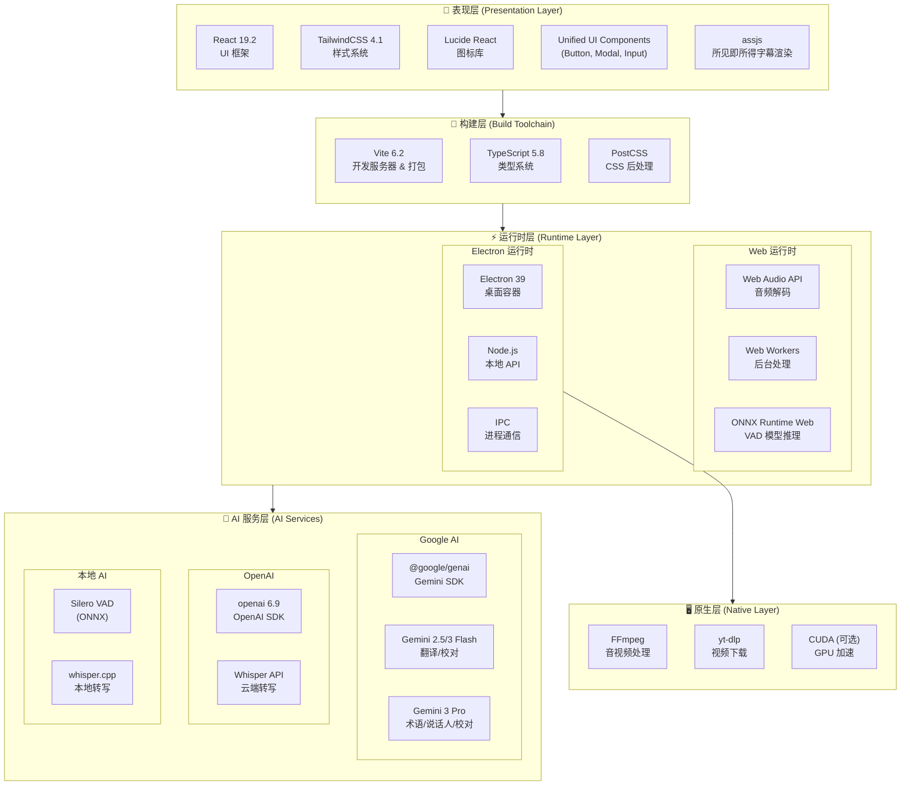

### 依赖版本一览

| 类别         | 依赖               | 版本   | 用途               |
| ------------ | ------------------ | ------ | ------------------ |
| **核心框架** | React              | 19.2   | UI 框架            |
|              | Vite               | 6.2    | 构建工具           |
|              | TypeScript         | 5.8    | 类型系统           |
|              | Electron           | 39     | 桌面容器           |
| **AI SDK**   | @google/genai      | Latest | Gemini API         |
|              | openai             | Latest | Whisper API        |
|              | onnxruntime-web    | 1.23   | VAD 推理           |
| **音频处理** | @ricky0123/vad-web | 0.0.30 | Silero VAD 封装    |
|              | fluent-ffmpeg      | 2.1    | FFmpeg 控制        |
| **国际化**   | i18next            | 25.7   | 国际化核心         |
|              | react-i18next      | 16.5   | React 绑定         |
| **字幕渲染** | assjs              | 0.1.4  | 所见即所得字幕渲染 |
| **样式**     | TailwindCSS        | 4.1    | 原子化 CSS         |
|              | Lucide React       | 0.554  | 图标库             |
| **工具**     | clsx / tw-merge    | Latest | 样式合并           |

---

## 📏 代码规范与工程化

### 路径别名 (Path Aliases)

本项目在 `src` 和 `electron` 目录下全面使用路径别名，**禁止使用相对路径** (如 `../../`) 引用跨层级模块，但同层级文件引用除外（推荐统一使用别名）。

- `@/*` -> `src/*` (核心源码)
- `@components/*` -> `src/components/*`
- `@hooks/*` -> `src/hooks/*`
- `@services/*` -> `src/services/*`
- `@utils/*` -> `src/utils/*`
- `@types/*` -> `src/types/*`
- `@lib/*` -> `src/lib/*` (新增)
- `@electron/*` -> `electron/*` (Electron 主进程代码)

### 目录组织原则

- **就近原则 (Co-location)**: 仅在特定模块内部使用的工具函数或组件，应放置在该模块的 `utils` 或 `shared` 子目录下，而非提升到全局。
  - 例如 `src/components/endToEnd/wizard/utils/validation.ts` 仅服务于向导模块。
- **关注点分离**:
  - `src/utils`: 全局通用、纯 JavaScript/UI 辅助函数。
  - `src/services/utils`: 基础设施、日志、系统级工具。

---

## 🧱 应用模块架构

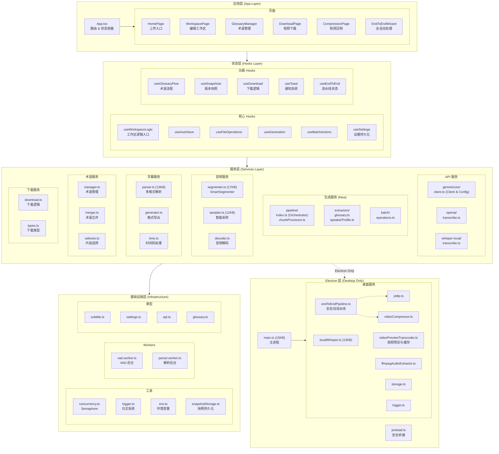

### 模块依赖关系图

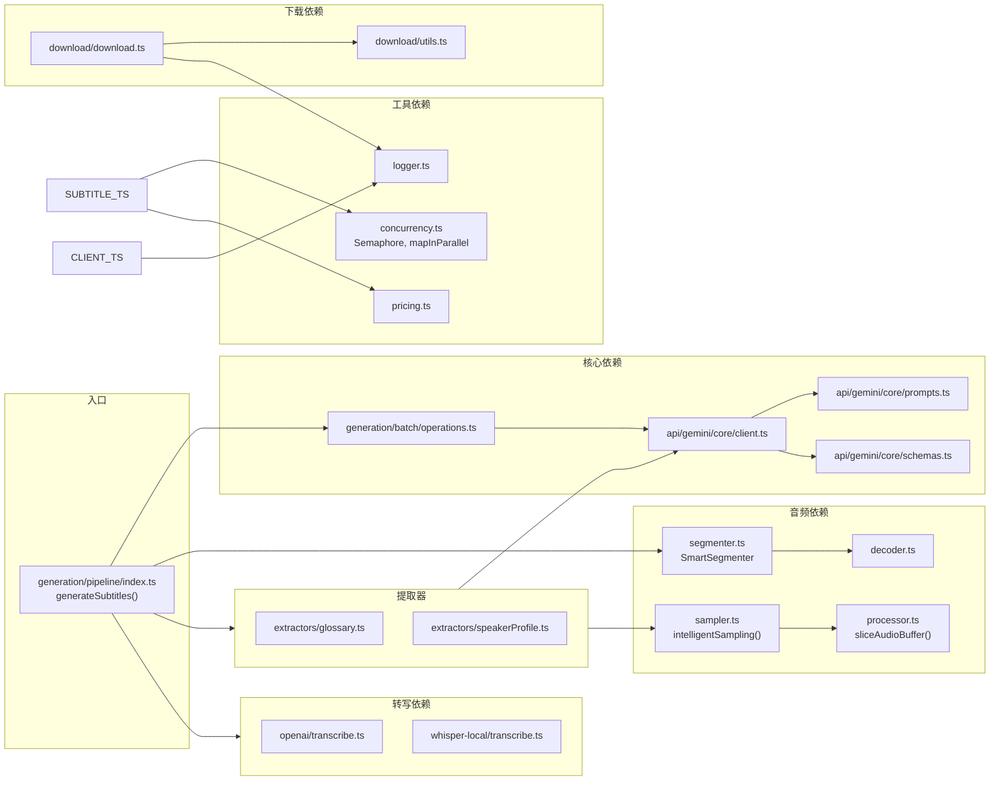

---

## 📁 目录结构

```
Gemini-Subtitle-Pro/
├── 📂 src/                          # 前端源代码
│   ├── 📄 App.tsx                   # 应用主入口
│   ├── 📄 index.tsx                 # React 渲染入口
│   ├── 📄 index.css                 # 全局样式
│   ├── 📄 i18n.ts                   # [NEW] 国际化配置入口
│   │
│   ├── 📂 components/               # UI 组件
│   │   ├── 📂 common/               # 通用业务组件 (Header, PageHeader 等)
│   │   ├── 📂 editor/               # 字幕编辑器组件 (SubtitleRow, Batch 等)
│   │   ├── 📂 pages/                # 页面级组件 (HomePage, WorkspacePage 等)
│   │   ├── 📂 ui/                   # 基础 UI 组件库 (Modal, Toggle, TextInput...)
│   │   ├── 📂 settings/             # 设置相关组件 (SettingsModal, SettingsPanel 等)
│   │   ├── 📂 layout/               # 布局容器
│   │   ├── 📂 modals/               # 业务弹窗 (SettingsModal 等)
│   │   ├── 📂 endToEnd/             # 端到端向导组件
│   │   └── 📂 ...                   # 其他按照功能划分的组件目录
│   │
│   ├── 📂 hooks/                    # React Hooks
│   │   ├── 📂 useWorkspaceLogic/    # 核心工作区逻辑 (拆分为多模块)
│   │   │   ├── 📄 index.ts          # 入口
│   │   │   └── 📄 ...               # 子逻辑 Hook
│   │   ├── 📄 useHardwareAcceleration.ts # 硬件加速状态
│   │   ├── 📄 useSettings.ts        # 设置管理
│   │   ├── 📄 useDownload.ts        # 下载逻辑
│   │   └── ...                      # 其他功能 Hooks
│   │
│   ├── 📂 locales/                  # [NEW] 国际化资源目录
│   │   ├── 📂 zh-CN/                # 简体中文
│   │   │   ├── 📄 common.json       # 通用文本
│   │   │   ├── 📄 home.json         # 首页
│   │   │   ├── 📄 editor.json       # 编辑器
│   │   │   ├── 📄 settings.json     # 设置
│   │   │   ├── 📄 endToEnd.json     # 端到端向导
│   │   │   └── 📄 ...               # 其他命名空间
│   │   └── 📂 en-US/                # 英语
│   │       └── 📄 ...               # 相同结构
│   │
│   ├── 📂 services/                 # 服务层 (纯逻辑)
│   │   ├── 📂 api/                  # API 集成 (Gemini Core, OpenAI)
│   │   │   └── 📂 gemini/           # Gemini 基础客户端与配置
│   │   │       ├── 📂 core/         # 核心 API 逻辑
│   │   │       └── 📂 utils/        # API 工具函数
│   │   ├── 📂 generation/           # 生成服务 (核心业务逻辑)
│   │   │   ├── 📂 pipeline/         # 完整流水线 (Orchestrator, ChunkProcessor)
│   │   │   ├── 📂 extractors/       # 信息提取 (Glossary, Speaker)
│   │   │   ├── 📂 batch/            # 批量操作
│   │   │   └── 📂 debug/            # 调试工具
│   │   ├── 📂 audio/                # 音频处理 (Segmenter, Sampler)
│   │   ├── 📂 subtitle/             # 字幕解析与生成 (Parser, Generator)
│   │   ├── 📂 download/             # 下载服务逻辑
│   │   └── 📂 utils/                # 通用服务工具 (Logger, URL 验证)
│   │
│   ├── 📂 config/                   # 配置模块
│   │   ├── 📄 index.ts              # 配置导出入口
│   │   └── 📄 models.ts             # 模型配置 (步骤→模型映射)
│   │
│   ├── 📂 lib/                      # 通用库
│   │   ├── 📄 cn.ts                 # Tailwind 类名合并工具
│   │   └── 📄 text.ts               # 文本处理工具
│   │
│   ├── 📂 types/                    # TypeScript 类型定义
│   └── 📂 workers/                  # Web Workers
│
├── 📂 electron/                     # Electron 桌面端代码
│   ├── 📄 main.ts                   # 主进程入口
│   ├── 📄 preload.ts                # 预加载脚本
│   └── 📂 services/                 # 桌面端服务 (Node.js 环境)
│       ├── 📄 localWhisper.ts       # 本地 Whisper 调用
│       ├── 📄 videoPreviewTranscoder.ts # [NEW] 视频预览与缓存
│       ├── 📄 logger.ts             # 统一日志服务
│       └── ...                      # 其他系统级服务
│
└── 📄 package.json                  # 项目配置
```

---

## 🔄 核心流程图

### 1. 完整 Pipeline 并发架构

下图展示了字幕生成的完整并发架构，包括并行异步任务、Semaphore 控制和跨任务依赖关系：

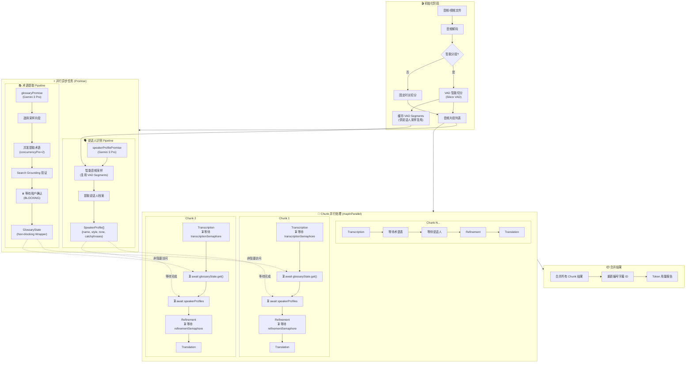

---

### 2. 双 Semaphore 并发控制详解

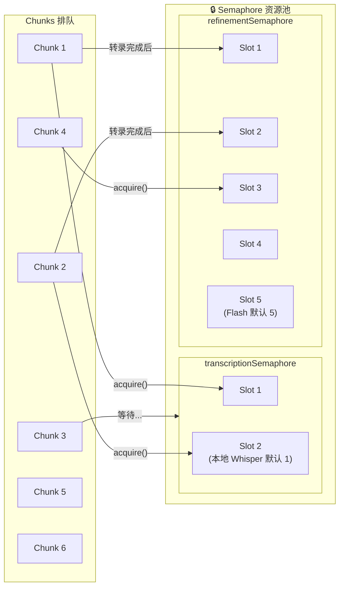

**配置说明：**

| Semaphore                | 用途                  | 默认并发数       | 配置项               |
| ------------------------ | --------------------- | ---------------- | -------------------- |
| `transcriptionSemaphore` | 控制 Whisper API 调用 | 本地: 1, 云端: 5 | `whisperConcurrency` |
| `refinementSemaphore`    | 控制 Gemini Flash API | 5                | `concurrencyFlash`   |
| (术语提取内部)           | 控制 Gemini Pro API   | 2                | `concurrencyPro`     |

---

### 3. Chunk 内部 4 阶段流水线

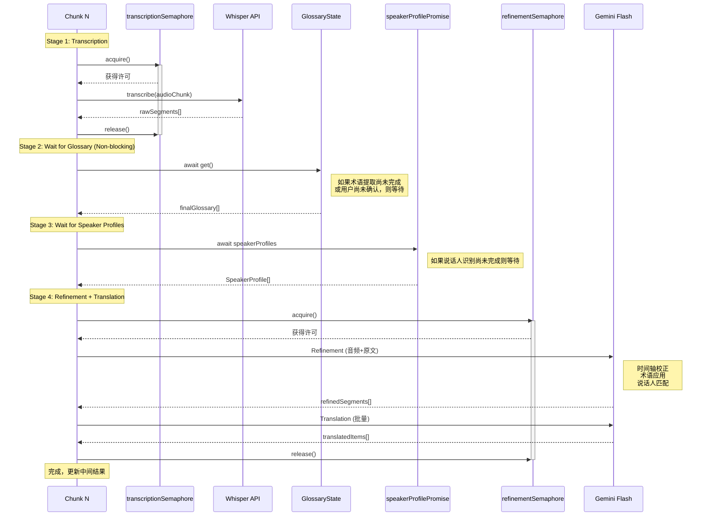

---

### 4. 术语提取与用户交互流程

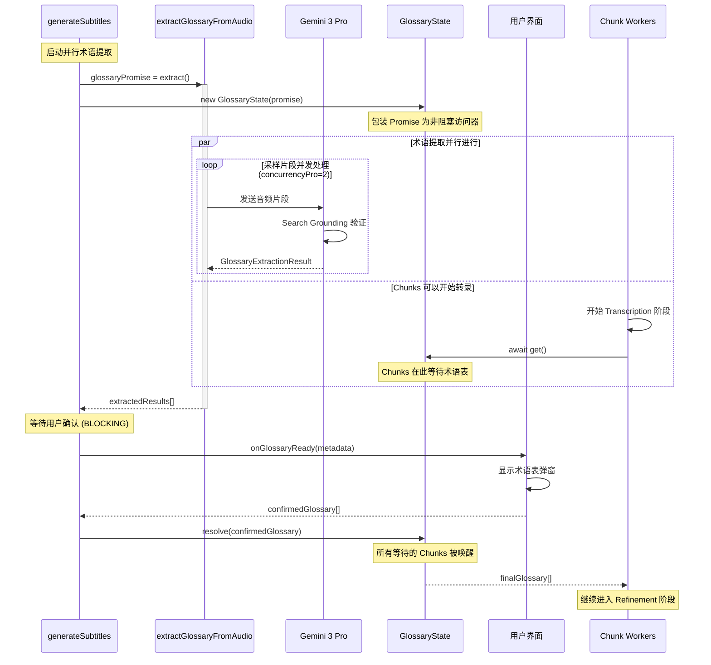

---

### 5. 说话人识别在 Pipeline 中的位置

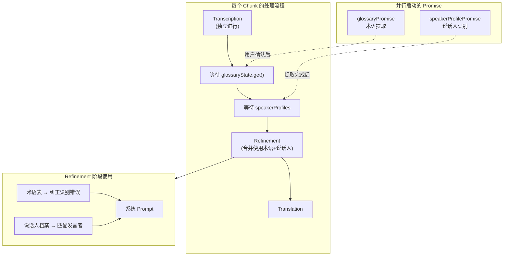

**Pipeline 依赖关系总结：**

| 阶段          | 依赖项                                | 说明                   |
| ------------- | ------------------------------------- | ---------------------- |
| Transcription | `transcriptionSemaphore`              | 独立执行，无阻塞依赖   |
| Wait Glossary | `glossaryState.get()`                 | 必须等待术语确认完成   |
| Wait Speakers | `speakerProfilePromise`               | 必须等待说话人识别完成 |
| Refinement    | `refinementSemaphore` + 术语 + 说话人 | 合并使用所有数据       |
| Translation   | (在 Refinement Semaphore 内)          | 随 Refinement 一起完成 |

---

### 6. 桌面端全流程 (下载-制作-压制)

桌面版独有的完整工作流，打通了从素材获取到成片输出的链路：

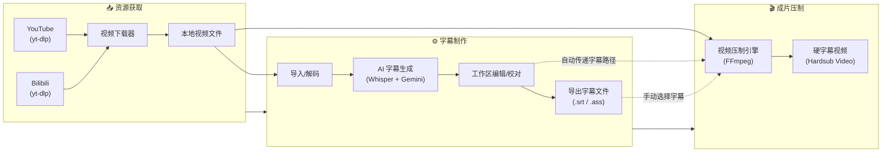

---

### 7. 全自动端到端模式 (End-to-End Pipeline)

这是 Electron 端独有的核心功能，通过 IPC 通信协调主进程（资源调度）与渲染进程（AI 运算），实现"一键熟肉"。

#### 7.1 跨进程交互架构

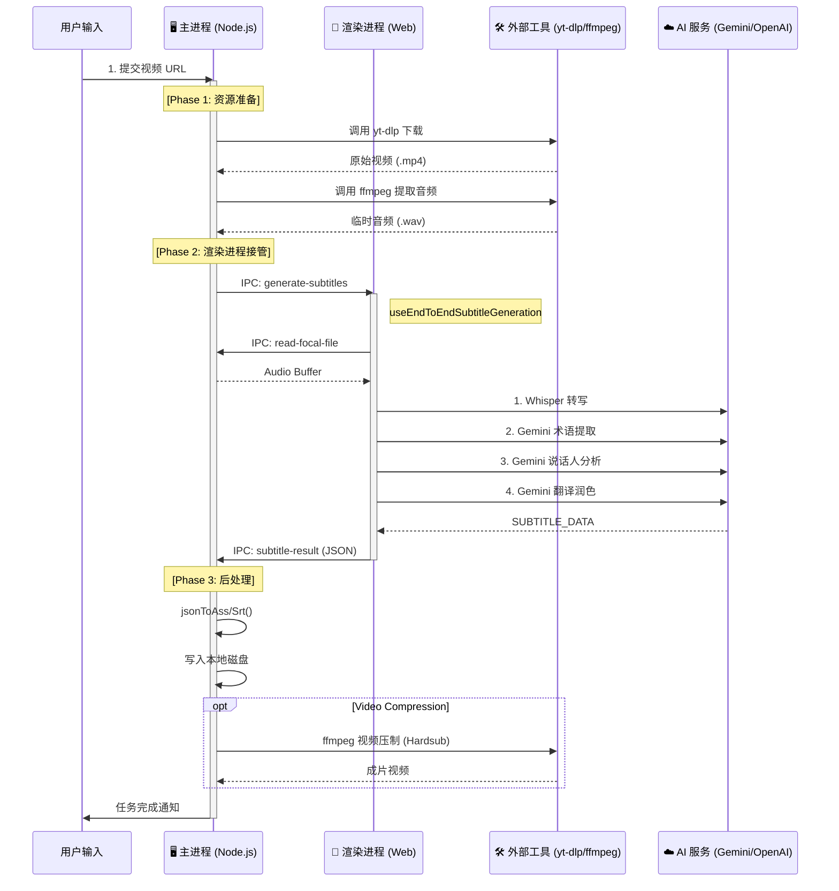

#### 7.2 数据流向与状态管理

所有中间状态和配置通过 `EndToEndWizard` 组件管理，数据流转如下：

1.  **用户配置 (Configuration)**
    - 源: `EndToEndWizard` UI
    - 流向: 通过 `IPC (start-processing)` -> 主进程 `EndToEndPipeline` 服务
    - 内容: URL, 模型选择, 翻译风格, 压制参数

2.  **音视频流 (Media Stream)**
    - `yt-dlp` -> 磁盘临时目录 -> `ffmpeg` (提取音频) -> 磁盘 WAV
    - 磁盘 WAV -> `IPC (read-file)` -> 渲染进程内存 (ArrayBuffer) -> Web Audio API

3.  **字幕数据 (Subtitle Data)**
    - 渲染进程生成 `SubtitleItem[]` 数组
    - 通过 `IPC (subtitle-result)` 回传主进程
    - 主进程将对象序列化为 ASS/SRT 格式文本并写入文件

4.  **进度反馈 (Progress Feedback)**
    - 各阶段 (下载/转写/压制) 均产生进度事件
    - 主进程 -> `IPC (progress)` -> 渲染进程 `useEndToEnd` Hook -> UI 进度条

#### 7.3 关键 IPC 通道

| 通道名 (Channel)                | 方向             | 载荷 (Payload)    | 作用                               |
| :------------------------------ | :--------------- | :---------------- | :--------------------------------- |
| `end-to-end:start`              | Renderer -> Main | `EndToEndConfig`  | 启动全自动任务                     |
| `end-to-end:generate-subtitles` | Main -> Renderer | `path, config`    | 主进程准备好音频，请求前端开始生成 |
| `end-to-end:subtitle-result`    | Renderer -> Main | `SubtitleItem[]`  | 前端完成生成，返回结果             |
| `end-to-end:progress`           | Main -> Renderer | `stage, progress` | 实时进度同步                       |

---

## 🛰️ 媒体播放自定义协议

为了绕过浏览器的安全限制（CSP、沙箱）并支持大文件流式播放，桌面版实现了一个自定义协议：

### `local-video://` 协议

- **实现位置**：`electron/main.ts`
- **核心权限**：`standard`, `secure`, `stream`, `supportFetchAPI`, `bypassCSP`。
- **关键技术：Tailing Reader**：支持读取“增长中的文件”（转码进行中）。它使用轮询机制读取 FFmpeg 正在写入磁盘的新数据。

---

## 📺 视频预览与缓存策略

系统采用分片 MP4 (fragmented MP4) 转码策略，平衡兼容性与性能。

### 流程图

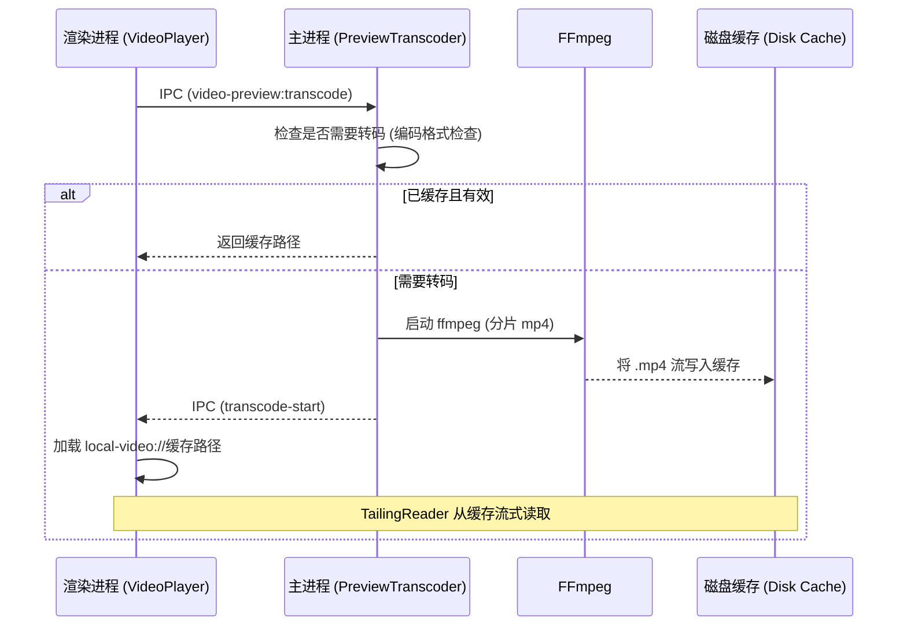

### 缓存生命周期

- **存储位置**：用户数据目录 (`/preview_cache/`)。
- **限制**：自动执行总大小限制（如 2GB）。
- **清理**：应用启动时自动检测，并支持 UI 手动清理。
  | `video-preview:transcode` | Renderer -> Main | `{ filePath }` | 请求视频预览转码 |
  | `video-preview:transcode-start` | Main -> Renderer | `{ outputPath }` | 转码已开始 |
  | `video-preview:transcode-progress` | Main -> Renderer | `{ percent }` | 转码进度更新 |
  | `video-preview:needs-transcode` | Renderer -> Main | `filePath` | 检查视频是否需要转码 |
  | `cache:get-size` | Renderer -> Main | - | 获取预览缓存大小 |
  | `cache:clear` | Renderer -> Main | - | 清理预览缓存 |

---

## 🧩 核心模块说明

### 1. 生成服务模块 (`src/services/generation/`) [NEW]

这是重构后的核心业务逻辑模块，将原有的 Gemini API 逻辑按职责拆分：

| 子模块       | 文件/目录               | 功能描述                                                |
| ------------ | ----------------------- | ------------------------------------------------------- |
| `pipeline`   | `index.ts`              | 生成流程总管 (Orchestrator)，协调转写、提取、生成全流程 |
|              | `chunkProcessor.ts`     | 单个 Chunk 的处理逻辑 (转写 -> 术语/说话人等待 -> 翻译) |
|              | `translation.ts`        | 具体翻译执行逻辑                                        |
|              | `glossaryHandler.ts`    | 术语应用逻辑                                            |
|              | `resultTransformers.ts` | 结果转换与后处理逻辑                                    |
| `extractors` | `glossary.ts`           | 术语提取器 (Gemini Pro + Search)                        |
|              | `speakerProfile.ts`     | 说话人档案提取器                                        |
| `batch`      | `operations.ts`         | 批量校对与时间轴修复操作                                |

### 2. Gemini API 核心 (`src/services/api/gemini/core/`)

只保留最基础的 API 交互能力：

| 文件         | 功能描述                                         |
| ------------ | ------------------------------------------------ |
| `client.ts`  | Gemini API 客户端封装，处理 auth、retry 和 quota |
| `prompts.ts` | 基础 Prompt 模板库                               |
| `schemas.ts` | 结构化输出的 Schema 定义                         |

### 3. 音频处理模块 (`src/services/audio/`)

| 文件                 | 功能描述                                                             |
| -------------------- | -------------------------------------------------------------------- |
| `segmenter.ts`       | **智能音频切分器**，使用 Silero VAD 模型检测语音活动，按语义边界切分 |
| `sampler.ts`         | 音频采样，生成用于 AI 分析的音频样本                                 |
| `decoder.ts`         | 音频解码，支持多种格式                                               |
| `processor.ts`       | 音频预处理，归一化等                                                 |
| `converter.ts`       | 音频格式转换                                                         |
| `ffmpegExtractor.ts` | FFmpeg 音频提取 (核心逻辑)                                           |

### 4. 字幕处理模块 (`src/services/subtitle/`)

| 文件                   | 功能描述                            |
| ---------------------- | ----------------------------------- |
| `parser.ts`            | 字幕解析器，支持 SRT/ASS/VTT 等格式 |
| `generator.ts`         | 字幕导出，生成双语字幕文件          |
| `time.ts`              | 时间码处理工具                      |
| `postCheck.ts`         | 字幕质量后检查                      |
| `timelineValidator.ts` | 字幕时间轴逻辑校验                  |

### 5. 下载服务模块 (`src/services/download/`)

| 文件          | 功能描述         |
| ------------- | ---------------- |
| `download.ts` | 视频下载逻辑封装 |
| `utils.ts`    | 下载相关工具函数 |

### 6. Electron 桌面端 (`electron/`)

| 文件                               | 功能描述                                   |
| ---------------------------------- | ------------------------------------------ |
| `main.ts`                          | Electron 主进程，窗口管理、IPC 通信        |
| `preload.ts`                       | 预加载脚本，暴露安全的 Node.js API         |
| `logger.ts`                        | **统一日志系统**，支持文件轮转和多级别日志 |
| `services/localWhisper.ts`         | 本地 Whisper 模型调用 (whisper.cpp)        |
| `services/ffmpegAudioExtractor.ts` | FFmpeg 音频提取，支持视频文件              |
| `services/ytdlp.ts`                | 视频下载服务 (YouTube/Bilibili)            |
| `services/videoCompressor.ts`      | 视频压制服务 (支持 GPU 加速)               |
| `services/endToEndPipeline.ts`     | **全自动流水线**，编排下载-转写-压制全流程 |

### 7. 国际化模块 (`src/locales/`, `src/i18n.ts`) [NEW]

基于 i18next 实现的完整国际化支持，提供中英双语界面：

| 文件/目录  | 功能描述                                     |
| ---------- | -------------------------------------------- |
| `i18n.ts`  | 国际化配置入口，初始化 i18next 和 React 绑定 |
| `locales/` | 翻译资源根目录                               |
| `zh-CN/`   | 简体中文翻译，包含 14 个命名空间文件         |
| `en-US/`   | 英文翻译，与 zh-CN 结构相同                  |

**命名空间组织：**

| 命名空间      | 内容                        |
| ------------- | --------------------------- |
| `common`      | 通用文本 (按钮、标签、错误) |
| `home`        | 首页内容                    |
| `workspace`   | 工作区页面                  |
| `editor`      | 字幕编辑器                  |
| `settings`    | 设置弹窗                    |
| `endToEnd`    | 端到端向导                  |
| `modals`      | 业务弹窗                    |
| `services`    | API 服务消息                |
| `compression` | 视频压制页面                |
| `download`    | 下载页面                    |
| `progress`    | 进度指示器                  |
| `ui`          | UI 组件                     |
| `app`         | 应用级文本                  |

---

## 🔧 技术特点

### 并发控制

```typescript
// 使用 Semaphore 控制并发数
const semaphore = new Semaphore(concurrency);
await mapInParallel(chunks, async (chunk) => {
  await semaphore.acquire();
  try {
    return await processChunk(chunk);
  } finally {
    semaphore.release();
  }
});
```

### 模型选择策略

模型配置集中在 `src/config/models.ts`，支持按处理步骤选择不同模型：

| 处理步骤             | 默认模型               | 特点                             |
| -------------------- | ---------------------- | -------------------------------- |
| `refinement`         | Gemini 2.5 Flash       | 时间轴校正 (规避 3.0 时间戳 Bug) |
| `translation`        | Gemini 3 Flash Preview | 翻译、Search Grounding           |
| `glossaryExtraction` | Gemini 3 Pro Preview   | 多模态、术语提取                 |
| `speakerProfile`     | Gemini 3 Pro Preview   | 说话人分析                       |
| `batchProofread`     | Gemini 3 Pro Preview   | 高质量校对、Search Grounding     |
| `batchFixTimestamps` | Gemini 2.5 Flash       | 时间轴修复                       |

每个步骤可独立配置：

- `thinkingLevel`: 思考深度 (`none`/`low`/`medium`/`high`)
- `useSearch`: 是否启用 Google Search
- `maxOutputTokens`: 最大输出 Token 数

### 重试机制

```typescript
// 自动重试可恢复的错误
async function generateContentWithRetry(
  ai: GoogleGenAI,
  params: any,
  retries = 3,
  signal?: AbortSignal,
  onUsage?: (usage: TokenUsage) => void,
  timeoutMs?: number
);
```

---

## 📊 数据流架构

### 主数据流图

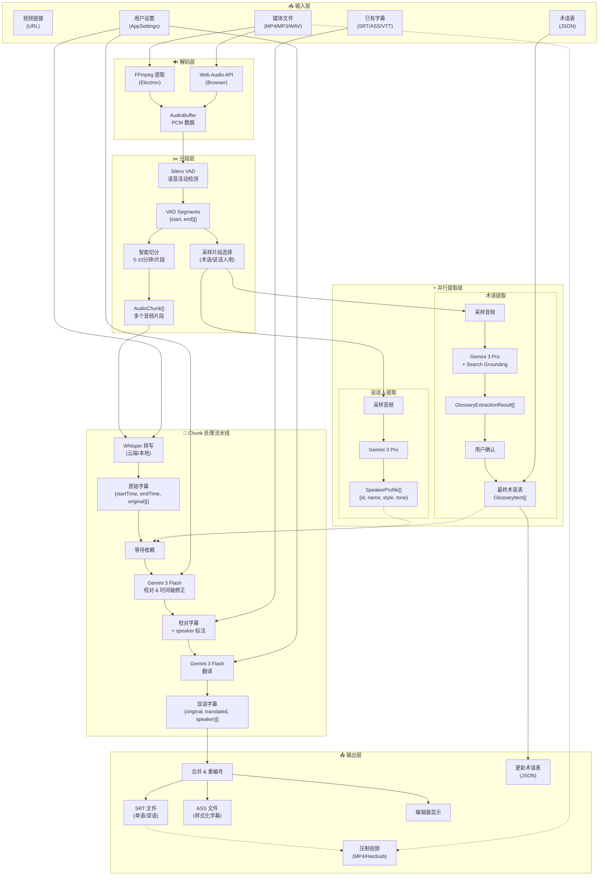

### 数据类型转换链

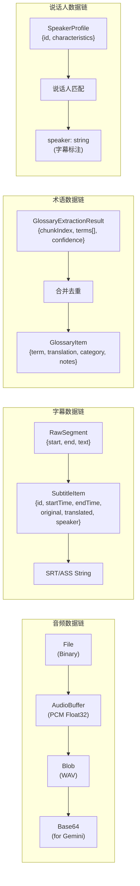

### 状态数据流

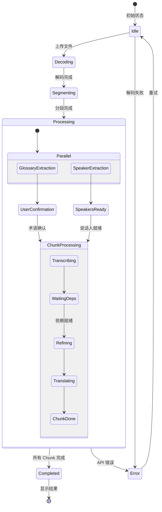

---

## 🚀 部署架构

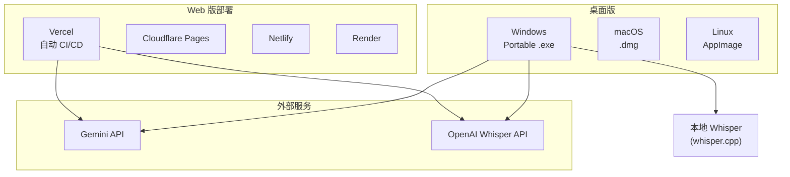

---

## 📝 开发指南

### 环境要求

- Node.js 18+
- npm 或 yarn

### 快速开始

```bash
# 安装依赖
yarn install

# Web 开发模式
yarn dev

# Electron 开发模式
yarn electron:dev

# 构建 Electron 应用
yarn electron:build
```

### 环境变量

```env
GEMINI_API_KEY=your_gemini_key    # 必需：翻译和校对
OPENAI_API_KEY=your_openai_key    # 可选：在线 Whisper
```

---

## 📚 参考资料

- [Google Gemini API 文档](https://ai.google.dev/docs)
- [OpenAI Whisper API](https://platform.openai.com/docs/guides/speech-to-text)
- [whisper.cpp 项目](https://github.com/ggerganov/whisper.cpp)
- [Silero VAD](https://github.com/snakers4/silero-vad)
