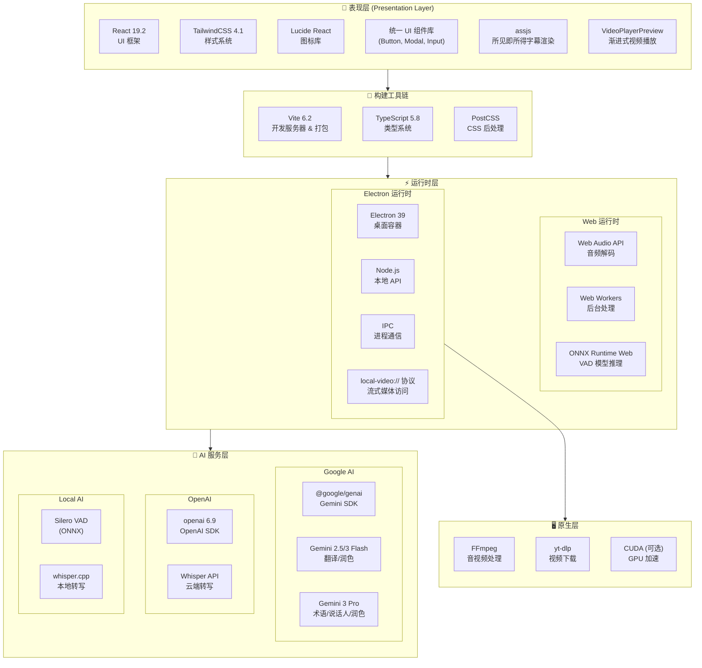

# 项目架构

## 📖 项目概述

**MioSub** 是一款 AI 驱动的视频字幕生成、翻译与润色工具。采用 React + Vite + Electron 技术栈构建，支持 Web 端和桌面客户端双端部署。

- **技术栈**: React 19, Vite 6, Electron 39, TypeScript
- **AI 引擎**: Google Gemini (翻译/润色), OpenAI Whisper (语音识别)

**DeepWiki项目详细解析：**[https://deepwiki.com/corvo007/Gemini-Subtitle-Pro](https://deepwiki.com/corvo007/Gemini-Subtitle-Pro)

---

## 🏗️ 技术栈架构

### 技术栈分层图

### 依赖版本概览

| 类别           | 依赖包             | 版本   | 用途            |
| :------------- | :----------------- | :----- | :-------------- |
| **核心框架**   | React              | 19.2   | UI 框架         |
|                | Vite               | 6.2    | 构建工具        |
|                | TypeScript         | 5.8    | 类型系统        |
|                | Electron           | 39     | 桌面容器        |
| **AI SDK**     | @google/genai      | Latest | Gemini API      |
|                | openai             | Latest | Whisper API     |
|                | onnxruntime-web    | 1.23   | VAD 推理        |
| **音视频处理** | @ricky0123/vad-web | 0.0.30 | Silero VAD 封装 |
|                | fluent-ffmpeg      | 2.1    | FFmpeg 控制     |
| **国际化**     | i18next            | 25.7   | 国际化核心      |
|                | react-i18next      | 16.5   | React 绑定      |
| **渲染**       | assjs              | 0.1.4  | ASS 字幕渲染    |
| **样式**       | TailwindCSS        | 4.1    | 原子化 CSS      |
|                | Lucide React       | 0.554  | 图标库          |
| **工具库**     | clsx / tw-merge    | Latest | 样式合并        |

---

## 📏 代码规范与工程化

### 路径别名 (Path Aliases)

本项目在 `src` 和 `electron` 目录下全面使用路径别名。除同级文件引用外（推荐统一使用别名），**禁止使用相对路径**（如 `../../`）进行跨层级模块引用。

- `@/*` -> `src/*` (核心源代码)
- `@components/*` -> `src/components/*`
- `@hooks/*` -> `src/hooks/*`
- `@services/*` -> `src/services/*`
- `@utils/*` -> `src/utils/*`
- `@types/*` -> `src/types/*`
- `@lib/*` -> `src/lib/*` (新增)
- `@electron/*` -> `electron/*` (Electron 主进程代码)

### 目录组织原则

- **就近原则 (Co-location)**：仅在特定模块内部使用的工具函数或组件，应放置在该模块的 `utils` 或 `shared` 子目录下，而不是提升到全局。
  - 例如，`src/components/endToEnd/wizard/utils/validation.ts` 仅服务于向导模块。
- **关注点分离**：
  - `src/utils`: 全局通用的、纯 JavaScript/UI 辅助函数。
  - `src/services/utils`: 基础设施、日志、系统级工具。
