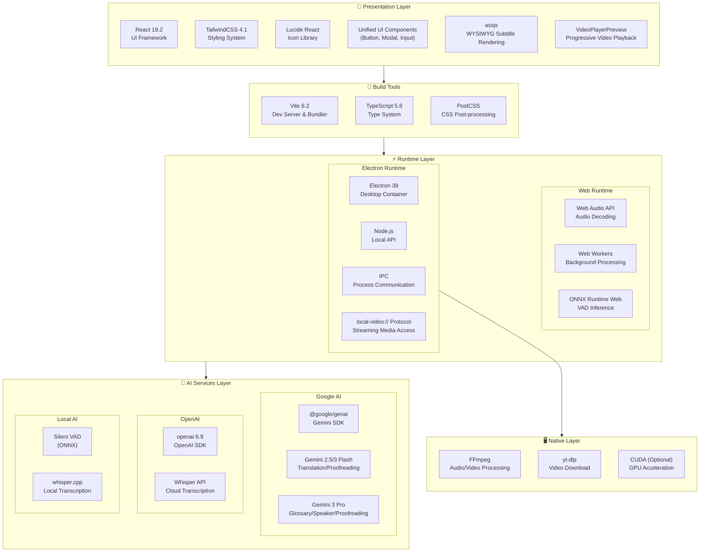

# Project Architecture

## 📖 Overview

**MioSub** is an AI-powered video subtitle generation, translation, and proofreading tool. Built with React + Vite + Electron, supporting both Web and Desktop deployment.

- **Tech Stack**: React 19, Vite 6, Electron 39, TypeScript
- **AI Engine**: Google Gemini (Translation/Proofreading), OpenAI Whisper (Speech Recognition)

**DeepWiki Project Analysis:** [https://deepwiki.com/corvo007/Gemini-Subtitle-Pro](https://deepwiki.com/corvo007/Gemini-Subtitle-Pro)

---

## 🏗️ Tech Stack Architecture

### Tech Stack Layers

### Dependency Versions

| Category      | Package            | Version | Purpose                |
| :------------ | :----------------- | :------ | :--------------------- |
| **Core**      | React              | 19.2    | UI Framework           |
|               | Vite               | 6.2     | Build Tool             |
|               | TypeScript         | 5.8     | Type System            |
|               | Electron           | 39      | Desktop Container      |
| **AI SDK**    | @google/genai      | Latest  | Gemini API             |
|               | openai             | Latest  | Whisper API            |
|               | onnxruntime-web    | 1.23    | VAD Inference          |
| **Media**     | @ricky0123/vad-web | 0.0.30  | Silero VAD Wrapper     |
|               | fluent-ffmpeg      | 2.1     | FFmpeg Control         |
| **i18n**      | i18next            | 25.7    | i18n Core              |
|               | react-i18next      | 16.5    | React Binding          |
| **Rendering** | assjs              | 0.1.4   | ASS Subtitle Rendering |
| **Styling**   | TailwindCSS        | 4.1     | Atomic CSS             |
|               | Lucide React       | 0.554   | Icon Library           |
| **Utilities** | clsx / tw-merge    | Latest  | Style Merging          |

---

## 📏 Coding Standards

### Path Aliases

This project uses path aliases throughout `src` and `electron` directories. Except for same-level file references, **relative paths (like `../../`) are prohibited** for cross-level module imports.

- `@/*` -> `src/*` (Core source code)
- `@components/*` -> `src/components/*`
- `@hooks/*` -> `src/hooks/*`
- `@services/*` -> `src/services/*`
- `@utils/*` -> `src/utils/*`
- `@types/*` -> `src/types/*`
- `@lib/*` -> `src/lib/*`
- `@electron/*` -> `electron/*` (Electron main process code)

### Directory Organization Principles

- **Co-location**: Utility functions or components used only within a specific module should be placed in that module's `utils` or `shared` subdirectory, not lifted to global scope.
  - Example: `src/components/endToEnd/wizard/utils/validation.ts` serves only the wizard module.
- **Separation of Concerns**:
  - `src/utils`: Global, pure JavaScript/UI helper functions.
  - `src/services/utils`: Infrastructure, logging, system-level utilities.
